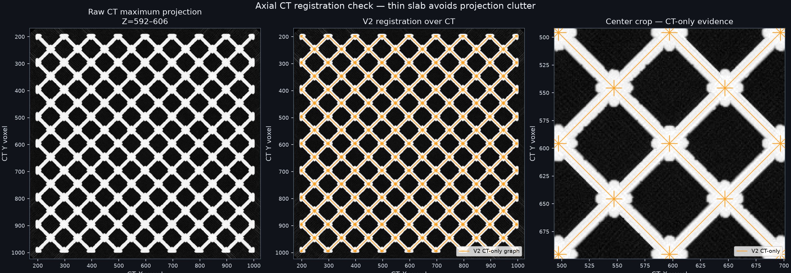
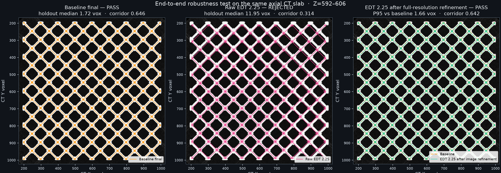

# PacificVis 8×8×8 blind CT registration

## Verdict

**PASS all internal registration gates; external validation pending.** The
CT-only registration is visually well aligned and passes every configured
internal evidence group. No registered JSON or PacificVis OBJ mesh was used by
the fit. The manifest still blocks trusted defect classification because no
multi-scan external-evidence summary was supplied.

This is a useful blind image-space test because the PacificVis directory has no
CT-aligned graph JSON. It is not a numeric accuracy test: there is no held-out
registered graph to measure per-node error against, and this CT dataset is
physically simulated rather than an independent experimental scan.

## Inputs and isolation

- CT: `five_defects_1200_xray_recon.npy`, float32, 1200×1200×1200
- nominal graph: `data/octet_truss_8x8x8/octet_truss_8x8x8.json`
- graph records: 7,168 junction records, 2,457 unique positions, 13,056 struts
- fit ground truth: `null`
- PacificVis OBJ meshes used: no
- registered JSON used: no
- completion order and frozen output hashes: recorded in `FIT_COMPLETE.json`

## Result

| Check | Result |
|---|---:|
| Full-volume Otsu threshold | 0.0055621546 native float intensity |
| Foreground | 97,755,064 voxels (5.657%) |
| Histogram quality | PASS; separability 0.935; two significant peaks |
| Synthetic transform recovery | PASS; 12/12 |
| Detected candidates | 3,439 total; 2,751 fit; 688 held out |
| Multi-start agreement | PASS; 21/21 near-optimal; P95 spread 0.000 voxels |
| End-to-end robustness | PASS; worst P95 transform shift 1.658 voxels |
| Independent image-space validation | PASS |
| Downstream radius/corridor check | PASS |
| Overall internal gates | **PASS** |
| External evidence | absent |
| Manifest classification authorization | **false** |

The fitted similarity transform is:

- scale: 49.939184 CT voxels per design unit
- rotation magnitude: 0.024701°
- translation XYZ: `[197.4843, 196.3419, 199.7456]`

Image-space evidence is unusually clean:

- every 5×5×5 registered junction patch contains foreground;
- median held-out candidate distance is 1.718 voxels;
- all 13,056 design strut corridors were sampled;
- median corridor foreground occupancy is 0.646;
- measured strut radius is 6 voxels;
- X/Y/Z spatial-bin occupancy ranges are 0.004/0.008/0.008.

The downsampled EDT sweep is the hardest case. Settings 1.75 and 2.00 recover
the same transform. EDT 2.25 retains only 1,667 fit candidates and initially
settles in a visibly inferior coarse solution. That raw solution has a
17.97-voxel P95 displacement from the baseline, only 0.314 median corridor
occupancy, zero measurable supported radius, and fails the image-space gate.

Applying the same full-resolution image refinement used by the production
pipeline recovers EDT 2.25 to 1.66 voxels P95 from the baseline. Its median
corridor occupancy becomes 0.642, its measured radius returns to 6 voxels, and
every image-space gate passes. Otsu offsets, ICP trim fractions, and bootstrap
resamples finish within 0.04 voxels P95 of the baseline.

The robustness implementation was corrected accordingly: perturbations are now
compared after the complete registration pipeline, including full-resolution
refinement, rather than comparing unfinished coarse ICP transforms.

## Axial registration check



Orange is the graph produced by this CT-only fit. The first panel is the raw
Z=592–606 maximum-intensity slab, the second overlays the full registered
graph, and the third is a center crop. There is no reference-colored line
because no registered reference was opened.

## EDT 2.25 true test



The middle panel demonstrates that the 17.56-voxel warning was real for the
unfinished coarse solution: it is visibly offset and is independently rejected
by junction, holdout-candidate, corridor-radius, and occupancy checks. The
right panel shows the full pipeline result. Full-resolution CT refinement
returns it close to the orange baseline and restores every image-space gate.

## Reproduce

```bash
./.venv/bin/python poc/ct_registration_v2/fit_registration.py \
  --ct "data/pacificvis/8x8x8 octet lattice with defects/five_defects_1200_xray_recon.npy" \
  --design data/octet_truss_8x8x8/octet_truss_8x8x8.json \
  --config poc/ct_registration_v2/config.pacificvis.json \
  --output-dir poc/ct_registration_v2/results/pacificvis_8x8x8_v2run
```

The fit exits with code `0` because all internal gates pass.
