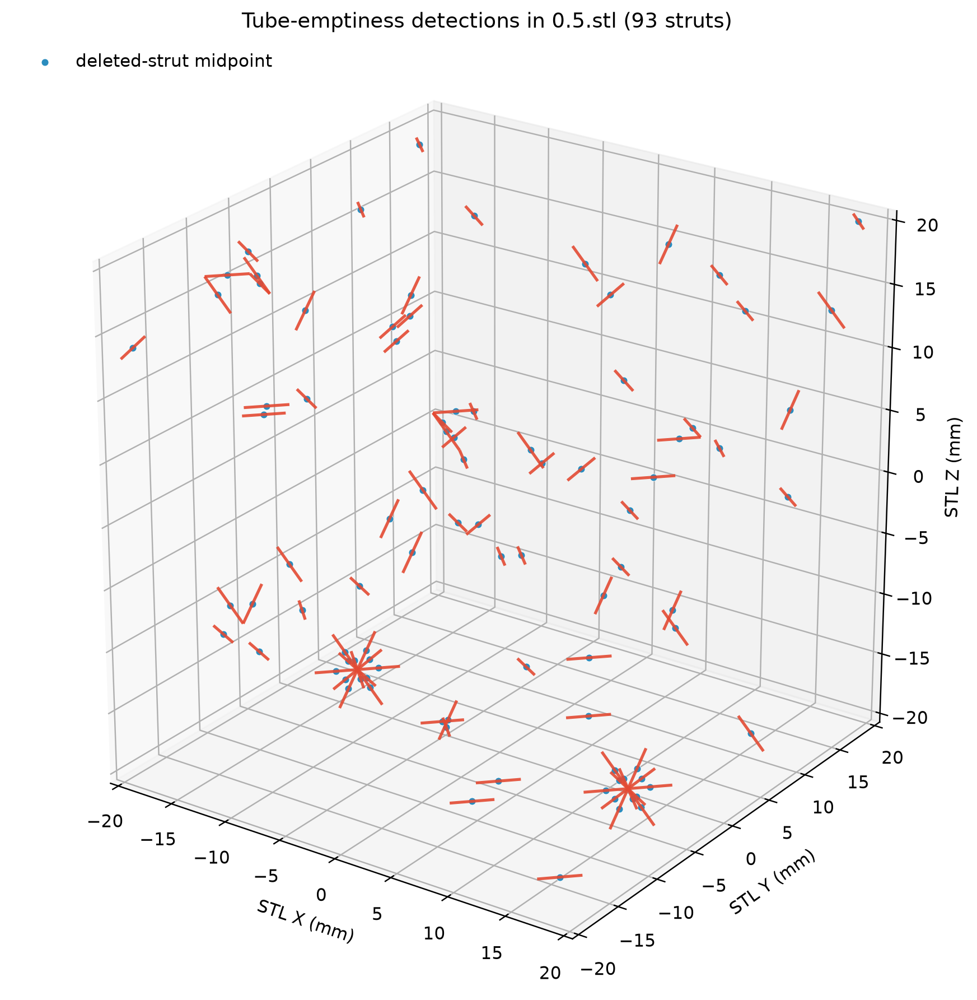

# Tube-Emptiness Strut-Deletion Test

This proof of concept recovers deleted octet-truss strut IDs by querying the design
centerlines against the STL surface. It uses `0.stl` as a negative control to calibrate
the JSON-to-STL scale and a safe tube radius, then applies the fixed calibration to all
four meshes.

## Run

From the repository root:

```bash
python3.11 poc/tube_emptiness_test/tube_test.py
```

The script needs NumPy, SciPy, and Matplotlib. If needed, install the project dependencies
and SciPy with:

```bash
python3.11 -m pip install -r requirements.txt scipy
```

The script reads one STL at a time. It writes all JSON and PNG artifacts to `results/` and
returns a nonzero exit status if any validation gate fails. `--scale` and `--radius` can be
used for controlled experiments; omit them for baseline calibration.

## Method

1. Read the ideal graph and map every strut ID to its two junction positions.
2. Parse each binary STL directly with a structured NumPy memory map and reduce every
   triangle to its centroid.
3. Transform design coordinates with `stl_mm = (json_coordinate - 9.0) * scale`.
4. Sample nine locations along the 40%-to-60% centerline core. The terminal regions are
   excluded so surface triangles belonging to shared junctions cannot make a deleted strut
   appear occupied.
5. Use a SciPy `cKDTree` to find the nearest STL centroid to each sample. A strut is deleted
   only when none of its samples has a centroid inside the calibrated radius.
6. Cross-check detections against the STL triangle deficit and the expected monotonic trend.

The baseline scale search minimizes mean per-strut nearest-centroid distance over candidates
near 2.30 mm/design-unit. The radius is the largest baseline nearest distance plus a 0.03 mm
safety margin, rounded upward to the next 0.01 mm.

## Results

The baseline calibration selected:

- Transform: `stl_mm = (json_coordinate - 9.0) * 2.3050`
- Tube radius: `0.400 mm`
- Point cloud: `3,482,368` to `3,514,642` triangle centroids, depending on the STL

| STL | Deleted struts | Triangle deficit | Triangles/deleted strut |
|---|---:|---:|---:|
| `0.stl` | 0 | 0 | — |
| `0.1.stl` | 18 | 3,184 | 176.89 |
| `0.5.stl` | 93 | 15,986 | 171.89 |
| `1.stl` | 186 | 32,274 | 173.52 |

All four validation gates pass. The 93 IDs detected in `0.5.stl` are an exact set match
to the independent midpoint-gap reference, while this test derives them from distributed
tube samples. Full machine-readable details are in `results/summary.json`; the individual
answer keys are in `results/deleted_struts_*.json`.


