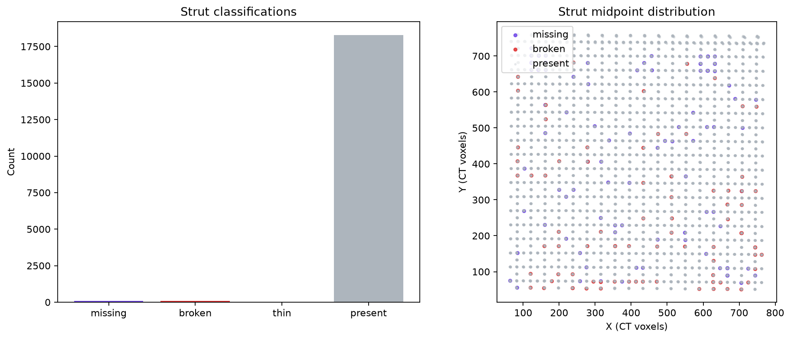
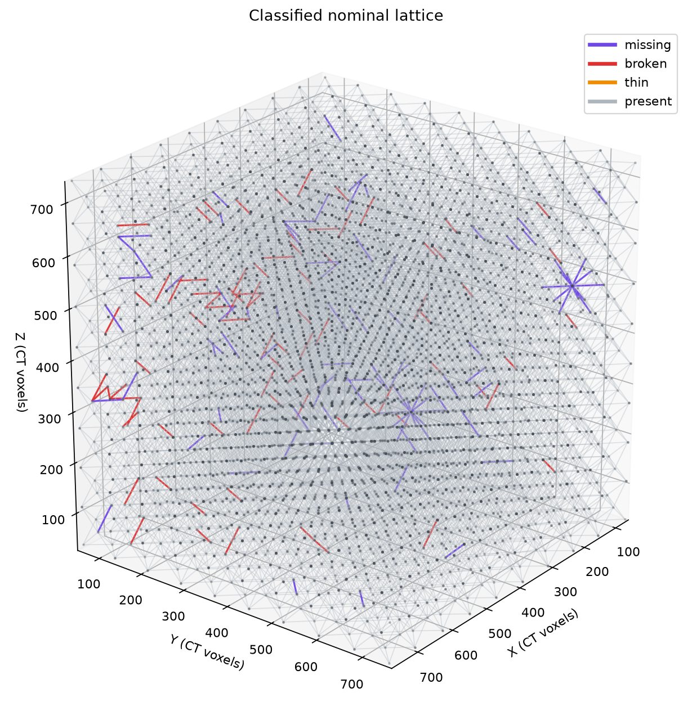

# Materials-Science NDE Report: `brian_tran_hackathon`

## Scope and interpretation basis

This seal-free hackathon Stage 3 report evaluates the localized nominal lattice using the artifact-backed, crop-filtered classifications in `stage2/classified_struts_report.json`. The graph-aware statistics and classified three-dimensional lattice view were generated from that same filtered classification file, `stage2/localized_graph.json`, and the frozen Stage 2 metrics. Reporting did not recompute registration, strut measurements, or classifications.

In this report, **missing** means that material is absent relative to a strut expected by the nominal graph. It does not establish an intentional design deletion and does not attribute cause or intent.

## Executive findings

The filtered report population comprises 18,468 nominal struts: 18,295 present, 92 missing, 81 broken, and 0 thin. The MCP spatial analysis reports 173 primary defect classifications, organized into 146 graph-connected clusters; the largest cluster contains 5 struts. The distribution therefore consists mainly of isolated or small connected neighborhoods rather than a single graph-spanning defect region.

The filtered classification artifact remains marked `manual_review` because upstream thin and bent specialist work was deferred. The Stage 3 spatial-statistics and lattice-render operations themselves both returned `status: ok` and `gate: pass`.

## Filtered class totals

| Classification | Count | MCP-reported fraction |
|---|---:|---:|
| Present | 18,295 | 99.0632% |
| Missing | 92 | 0.4982% |
| Broken | 81 | 0.4386% |
| Thin | 0 | 0.0000% |
| **Total** | **18,468** | **100.0000%** |

These displayed counts exactly match `stage2/classified_struts_report.json`. They also match both `stage3/spatial_statistics.json` and the counts returned by the classified 3D lattice render.

## Spatial and metric observations

The localized graph contains 10,206 nodes, 18,468 struts, and 729 cells. Its coordinate span is 710.07 × 710.29 × 715.05 voxels. The graph-aware spatial analysis identifies 146 connected defect clusters, with a maximum cluster size of 5 struts. Cluster location and shared-junction topology should guide follow-up inspection because neighboring affected members may influence the same local load path.

Artifact-backed class medians provide context for the report-visible classes:

- Missing: corridor foreground fraction 0.209, maximum axial-gap fraction 1.000, EDT radius 0 voxels, and curvature RMS 0 voxels.
- Broken: corridor foreground fraction 0.374, maximum axial-gap fraction 0.273, EDT radius 2.24 voxels, and curvature RMS 1.80 voxels.
- Present: corridor foreground fraction 0.411, maximum axial-gap fraction 0.000, EDT radius 2.83 voxels, and curvature RMS 0.321 voxels.

These medians summarize already-frozen measurements; classification depends on the complete persisted connectivity and profile rule set, not any single median.

## Bounded flagged-strut traceability

Four exemplars were selected only from the post-filter viewer CSVs: missing struts 10 and 214 from `stage2/csv/missing_struts_viewer_filtered.csv`, and broken struts 178 and 434 from `stage2/csv/broken_struts_viewer_filtered.csv`. Each CSV row records `touches_excluded_nominal_plane=False`. Each compact record was loaded through the MCP `get_strut_report` interface from the filtered classifications, frozen metrics, and frozen thresholds; every call returned `status: ok`, `gate: pass`, and artifact-backed provenance with `metrics_recomputed: false`.

| Strut | Class | Artifact-backed classification basis | Selected persisted metric evidence |
|---:|---|---|---|
| 10 | Missing | Primary disconnection; central present-slice fraction at most 10% | Axial-gap fraction 1.000; collar fractions 0 / 0; corridor foreground 0.179; A–B disconnected |
| 214 | Missing | Primary disconnection; central present-slice fraction at most 10% | Axial-gap fraction 1.000; collar fractions 0 / 0; corridor foreground 0.195; A–B disconnected |
| 178 | Broken | Central material-loss rule; endpoint support observed; disconnected-fragment case | Axial-gap fraction 0.424; collar fractions 0.115 / 0.319; corridor foreground 0.356; A–B disconnected |
| 434 | Broken | Central material-loss rule; endpoint support observed; disconnected-fragment case | Axial-gap fraction 0.424; collar fractions 0.292 / 0.106; corridor foreground 0.352; A–B disconnected |

All four records are ROI-valid and have `attribution: not_attributed`. This bounded set illustrates the two report-visible defect modes and establishes traceability; it is not a statistical sample.

## Materials disposition perspective

The 92 missing members lack material continuity along nominal member corridors under the frozen rule set and therefore merit priority review of the affected local load paths. The 81 broken members retain endpoint material support but are A–B disconnected and satisfy the central material-loss rule; they warrant local review for section interruption and loss of effective load transfer. Engineering disposition should consider cluster location, neighboring-member condition, loading, boundary conditions, and the original CT evidence. This report does not determine serviceability, manufacturing cause, or design intent.

## Limitations

The filtered report artifact is a presentation view of the upstream scientific state. The unfiltered `stage2/classified_struts.json` records 416 missing, 902 broken, 0 thin, 0 present, and 17,150 deferred struts, totaling 18,468. For the report view, all 17,150 deferred records were remapped to present; findings on the high-Y nominal crop face at `y=18` were excluded from report-visible defects (324 missing and 2 broken); and 819 connected-bite broken findings were remapped to present because report-visible broken requires A–B disconnection. These remaps do not alter the unfiltered scientific artifact.

Thin and bent analysis was deferred upstream. Consequently, the filtered count of 0 thin and the spatial summary count of 0 bent are not evidence that every strut was independently cleared for thickness or bending.

No evidence manifest was supplied to the four `get_strut_report` calls, so they returned persisted metrics, reasons, thresholds, and hashes but no separately rendered local CT evidence panels. The exemplar table must therefore be interpreted as compact artifact-backed traceability, not visual confirmation.

## Report artifacts and provenance

- Filtered classifications: `stage2/classified_struts_report.json`
- Localized graph: `stage2/localized_graph.json`
- Frozen metrics: `stage2/per_strut_metrics.csv`
- Filtered missing index: `stage2/csv/missing_struts_viewer_filtered.csv`
- Filtered broken index: `stage2/csv/broken_struts_viewer_filtered.csv`
- Spatial statistics: `stage3/spatial_statistics.json`
- Spatial figure: `stage3/spatial_statistics.png`
- Classified 3D lattice: `stage3/lattice_3d.png`

All reporting MCP responses used `response_schema_version: part2-mcp-response/1.0.0`. Both generated science products bind to filtered-classification SHA-256 `49ba87cf9cf0d79d07ae805708fa74711637c57a02f5f324d2ef8b094a7df2db`, localized-graph SHA-256 `85245058a34d30456fc1021c98364f9d8c8b2a79b37d7b8c97396f0bfb1b687f`, and, where applicable, metric SHA-256 `22cfd3aabc726067a61edfc12bd5063b046be0dc2a8b4eacd22a4c508d927ea9`.
