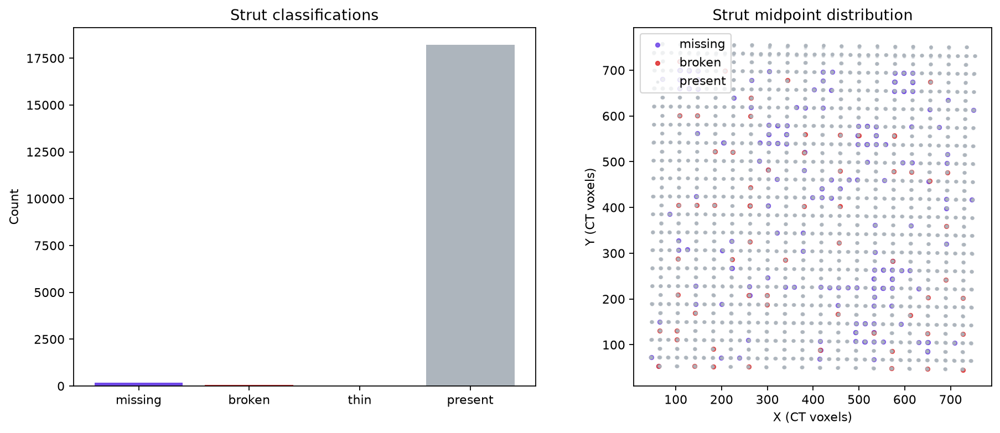
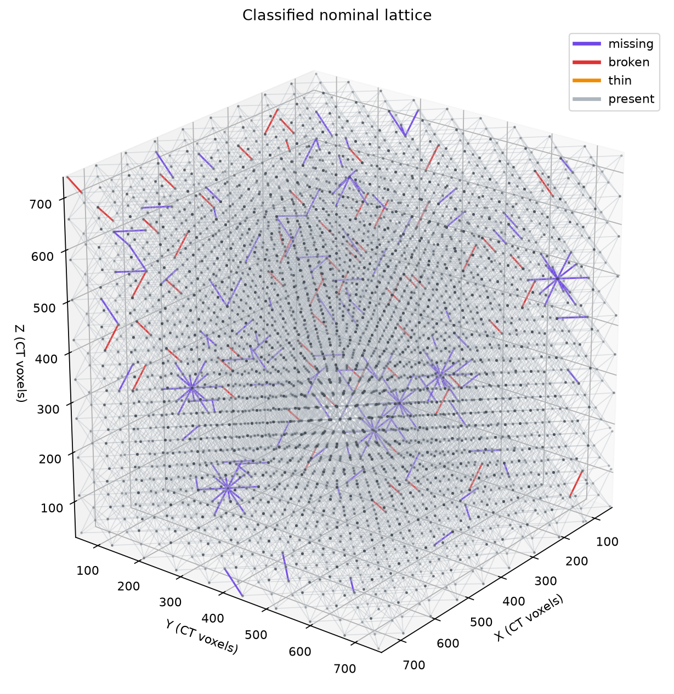

# Materials-Science NDE Report: `brian_tran_hackathon`

## Scope and interpretation basis

This seal-free hackathon Stage 3 report evaluates the localized nominal lattice using the artifact-backed report classifications in `../stage2/classified_struts_report.json`. That artifact is the presentation-filtered view of the upstream scientific classifications: deferred findings, high-Y crop-face findings at nominal `y=18`, and connected-bite broken findings were remapped to present according to the recorded hackathon report policy. The graph-aware statistics and classified three-dimensional lattice view were generated from the same filtered classifications, `../stage2/localized_graph.json`, and the frozen Stage 2 metrics. Reporting did not recompute registration, strut measurements, or classifications.

In this report, **missing** means material is absent relative to a strut expected by the nominal graph. It does not establish an intentional design deletion and does not attribute manufacturing cause or intent.

## Executive findings

The report population comprises 18,468 nominal struts: 18,226 present, 178 missing, 64 broken, and 0 thin. The 242 report-visible primary defects represent 1.3104% of nominal struts and form 185 graph-connected clusters; the largest cluster contains 8 struts. The topology is therefore dominated by isolated or small connected defect neighborhoods rather than one graph-spanning defect region.

The filtered classification artifact remains at `gate: manual_review` and `overall_pass: false` because thin and bent specialist work was deferred upstream. The Stage 3 spatial-statistics and classified-lattice-render operations themselves both returned `status: ok` and `gate: pass`.

## Filtered class totals

| Classification | Count | MCP-reported fraction |
|---|---:|---:|
| Present | 18,226 | 98.6896% |
| Missing | 178 | 0.9638% |
| Broken | 64 | 0.3465% |
| Thin | 0 | 0.0000% |
| **Total** | **18,468** | **100.0000%** |

These totals exactly match `../stage2/classified_struts_report.json`, `spatial_statistics.json`, the classified 3D lattice render, and the viewer-filtered CSV row counts (178 missing and 64 broken).

## Spatial and metric observations

The localized graph contains 10,206 nodes, 18,468 struts, and 729 cells. Its voxel-coordinate span is 712.78 × 712.66 × 712.02. The graph-aware spatial analysis identifies 185 connected defect clusters, with a maximum cluster size of 8 struts. Three maximum-size neighborhoods are recorded in the spatial artifact: struts 2600/2601/2602/2603/2613/2616/2619/2623, 7516/7517/7518/7519/7524/7525/7526/7527, and 9456/9457/9458/9459/9469/9472/9475/9479. Cluster location and shared-junction topology should guide follow-up inspection because neighboring affected members may influence the same local load path.

Artifact-backed class medians provide materials context for the report-visible classes:

- Missing: corridor foreground fraction 0.197, maximum axial-gap fraction 1.000, EDT radius 0 voxels, and curvature RMS 0 voxels.
- Broken: corridor foreground fraction 0.337, maximum axial-gap fraction 0.212, EDT radius 2.24 voxels, and curvature RMS 2.35 voxels.
- Present: corridor foreground fraction 0.345, maximum axial-gap fraction 0.000, EDT radius 2.83 voxels, and curvature RMS 0.340 voxels.

These medians summarize already-frozen measurements. Classification depends on the complete persisted connectivity and profile rule set, not any single median.

## Flagged-strut traceability

The MCP `get_strut_report` interface was called for every strut remaining in the two viewer-filtered indices: all 178 rows in `../stage2/csv/missing_struts_viewer_filtered.csv` and all 64 rows in `../stage2/csv/broken_struts_viewer_filtered.csv`. All 242 calls used the filtered classifications, frozen metrics, and frozen thresholds; every response returned `response_schema_version: part2-mcp-response/1.0.0`, `status: ok`, `gate: pass`, artifact-backed provenance, and `metrics_recomputed: false`. No thin calls were required because the report-visible thin count is zero.

Four CSV-backed records illustrate the two report-visible modes:

| Strut | Class | Artifact-backed classification basis | Selected persisted metric evidence |
|---:|---|---|---|
| 10 | Missing | Primary disconnection; central present-slice fraction at most 10% | Axial-gap fraction 1.000; collar fractions 0 / 0; corridor foreground 0.153; A–B disconnected |
| 2600 | Missing | Primary disconnection; central present-slice fraction at most 10% | Axial-gap fraction 1.000; collar fractions 0 / 0; corridor foreground 0.103; A–B disconnected |
| 231 | Broken | Central material-loss rule; endpoint support observed; disconnected-fragment case | Axial-gap fraction 0.364; collar fractions 0.208 / 0.050; corridor foreground 0.351; A–B disconnected |
| 7424 | Broken | Central material-loss rule; endpoint support observed; disconnected-fragment case | Axial-gap fraction 0.118; collar fractions 0.107 / 0.232; corridor foreground 0.344; A–B disconnected |

Each exemplar is marked `touches_excluded_nominal_plane=False` in its viewer-filtered CSV, is ROI-valid, and has `attribution: not_attributed`. The examples establish traceability and are not a statistical sample.

## Materials disposition perspective

The 178 missing members lack material continuity along nominal member corridors under the frozen rule set and merit priority review of their local load paths. The 64 broken members retain endpoint material support but are A–B disconnected and satisfy the central material-loss rule; they warrant local review for section interruption and loss of effective load transfer. The three eight-member clusters deserve particular attention because multiple affected members share connected graph neighborhoods.

Engineering disposition should consider defect-cluster location, neighboring-member condition, applied loading, boundary conditions, and the original CT evidence. This report does not determine serviceability, manufacturing cause, or design intent.

## Unfiltered scientific state and limitations

The primary totals above are deliberately based on the filtered report artifact. The unfiltered scientific artifact, `../stage2/classified_struts.json`, records 501 missing, 965 broken, 0 thin, 0 present, and 17,002 deferred struts, totaling 18,468. For this presentation view:

- 323 missing findings touching the nominal high-Y crop face at `y=18` were remapped to present; no broken findings were excluded by that crop-plane rule.
- 901 connected-bite broken findings were remapped to present because report-visible broken requires A–B disconnection.
- All 17,002 deferred findings were remapped to present.

The count bridge reconciles exactly: 501 − 323 = 178 report-visible missing; 965 − 901 = 64 report-visible broken; and 17,002 + 323 + 901 = 18,226 report-visible present. These remaps do not alter the unfiltered scientific artifact.

Thin and bent analysis was deferred upstream. Consequently, the filtered count of 0 thin and the spatial summary count of 0 bent are not evidence that every strut was independently cleared for thickness or bending. Likewise, remapping deferred records to present is a report-view convention, not a scientific finding of defect-free material.

No evidence manifest was supplied to `get_strut_report`, so the compact records contain persisted classifications, reasons, measurements, thresholds, and provenance but no separately rendered local CT evidence panels. Final disposition should return to the source CT data and appropriate local evidence review.

## Report artifacts and provenance

- Filtered classifications: `../stage2/classified_struts_report.json`
- Unfiltered classifications: `../stage2/classified_struts.json`
- Localized graph: `../stage2/localized_graph.json`
- Frozen metrics: `../stage2/per_strut_metrics.csv`
- Frozen thresholds: `../stage2/thresholds.json`
- Filtered missing index: `../stage2/csv/missing_struts_viewer_filtered.csv`
- Filtered broken index: `../stage2/csv/broken_struts_viewer_filtered.csv`
- Spatial statistics: `spatial_statistics.json`
- Spatial figure: `spatial_statistics.png`
- Classified 3D lattice: `lattice_3d.png`

The generated spatial and lattice products bind to filtered-classification SHA-256 `4d81b2166f55597f92ca83f2a11f32b3a4bd46204a9c811621d88ee8aadb92bc` and localized-graph SHA-256 `4dcb842d26ef65cb5cb90b8ea339afaf1dc33d9574f647dfa189a113c4db29cb`. The spatial artifact additionally binds to metric SHA-256 `cbb5a297834e0054d2ee3f182dbe601d04a7a781674fb1af28e4fbc94f50bc6d`.
