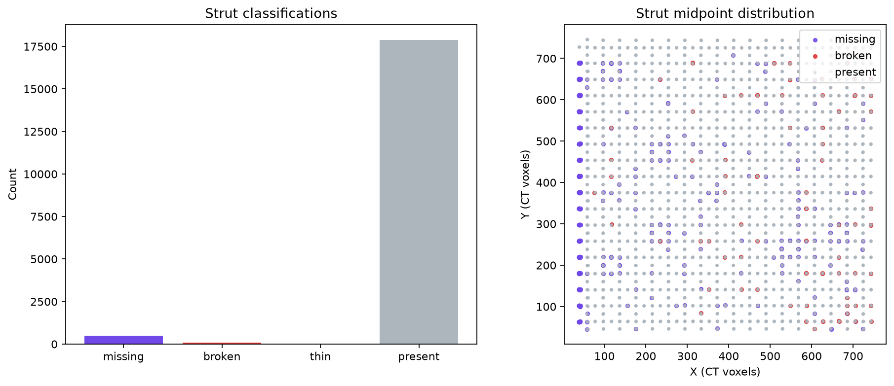
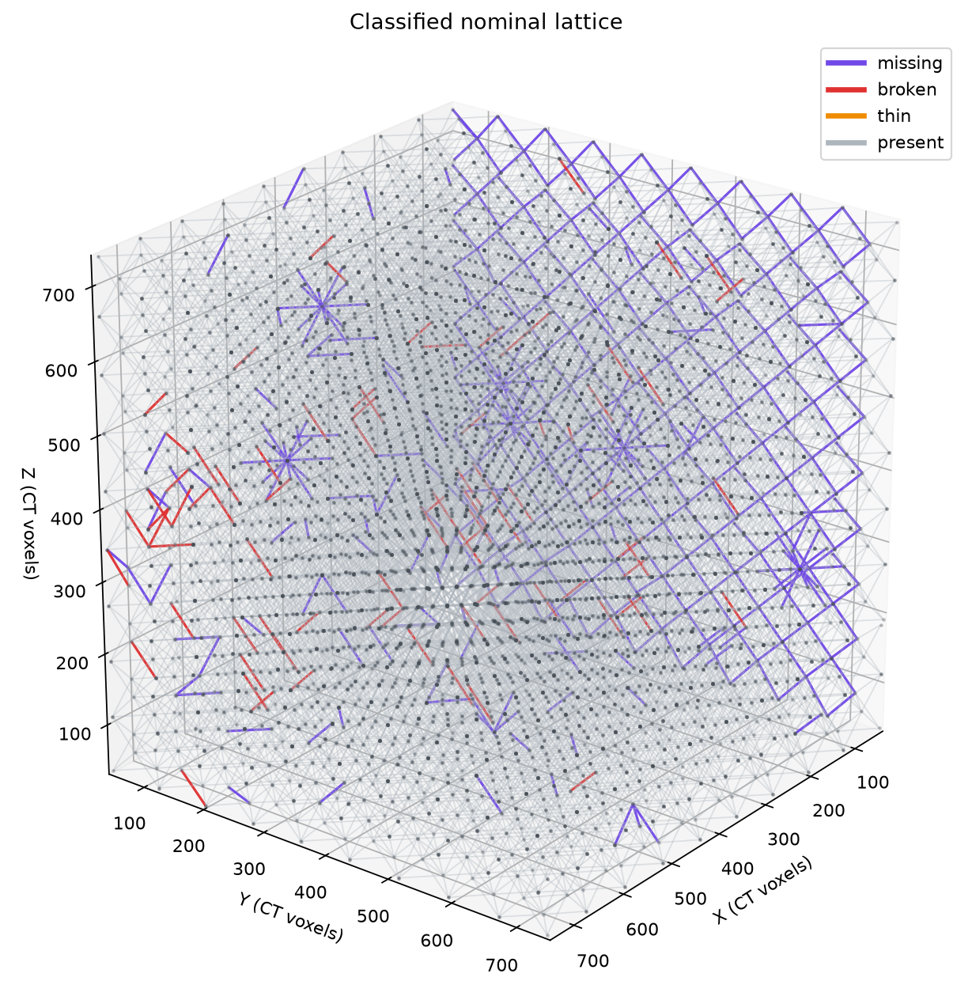

# Materials NDE Report — brian_tran_hackathon

## Executive disposition

The seal-free Stage 3 assessment is **complete with a manual-review gate**. The filtered reporting population contains 18,468 nominal struts, of which 574 (3.108%) remain classified as primary defects after the report-specific crop-plane and connectivity filters: 491 missing and 83 broken. The spatial-statistics and classified-lattice rendering operations both passed their MCP gates.

This is a development-mode hackathon report, not a hash-sealed production acceptance record. The source classification artifact remains `manual_review`, thin and bent specialist implementations are deferred, and no evidence-image manifest was available for the per-strut report calls. Engineering disposition therefore requires review of the source CT evidence.

## Scope and terminology

This report uses the localized nominal lattice graph, frozen per-strut measurements, and `classified_struts_report.json`. The reporting classification is a filtered view prepared for the final viewer/report scope; it does not recompute registration, metrics, or defect science.

“Missing” means that material corresponding to a nominal graph strut is absent according to the frozen connectivity and central-slice rules. It is an observation relative to the nominal graph and is **not** an attribution of intentional design deletion. “Broken” means the report retained a material-loss case with endpoint support but no material component connecting end A to end B.

## Filtered population and number crosscheck

| Report class | Count | Fraction of nominal struts |
|---|---:|---:|
| Present | 17,894 | 96.892% |
| Missing | 491 | 2.659% |
| Broken | 83 | 0.449% |
| Thin | 0 | 0.000% |
| **Total** | **18,468** | **100.000%** |

The 491 missing rows in `stage2/csv/missing_struts_viewer_filtered.csv` and 83 broken rows in `stage2/csv/broken_struts_viewer_filtered.csv` exactly match the filtered classification totals. Artifact-backed `get_strut_report` retrievals were completed for all 574 retained flagged struts: 574 returned `status=ok`, `gate=pass`, and `part2-mcp-response/1.0.0`, with no class mismatches. No thin struts remained to retrieve.

The graph-aware spatial artifact independently crosschecks 10,206 nodes, 18,468 struts, 729 cells, and 574 primary defects. It identifies 269 connected defect clusters; the largest contains eight struts.

## Materials findings

The missing population is the dominant reportable condition, accounting for 85.5% of retained primary defects (491 of 574). Its median corridor foreground fraction is 0.0175 and median maximum axial-gap fraction is 1.000, compared with 0.3352 and 0.000, respectively, for the present population. These frozen measurements are consistent with extensive material absence along the nominal strut corridors.

The broken population is smaller but mechanically relevant because it retains material at both ends without an A–B material connection. Its median corridor foreground fraction is 0.3206, close to the present median of 0.3352, while its median maximum axial-gap fraction is 0.2424 rather than zero. This pattern is consistent with localized loss or fragmentation interrupting otherwise material-bearing struts.

Viewer-filtered CSV examples illustrate the distinction:

- Missing strut 4 is A–B disconnected, has a central material-slice fraction of 0.0, a 33-slice longest empty run, and does not show both endpoint segments.
- Broken strut 421 is A–B disconnected but shows both endpoint segments, with a central material-loss fraction of 0.3393 and a 10-sample longest deficit run.

The largest spatial clusters each contain eight retained defective struts. Examples are `{10796, 10797, 10798, 10799, 10803, 10807, 10808, 10809}`, `{11228, 11229, 11230, 11231, 11241, 11244, 11247, 11251}`, and `{16808, 16809, 16810, 16811, 16825, 16828, 16831, 16835}`. These multi-strut neighborhoods should be prioritized during CT review because clustered discontinuities can compromise alternate load paths more severely than isolated indications.

## Scientific-count context and limitations

The unfiltered scientific classification remains in `stage2/classified_struts.json` and records 519 missing, 1,049 broken, 16,900 deferred, 0 present, and 0 thin struts. The filtered reporting artifact remaps the 16,900 deferred records to present for visualization, excludes 28 missing and 37 broken struts touching the nominal `y=18` crop face, and remaps an additional 929 connected-bite broken records to present because the final broken scope requires A–B disconnection. These operations change the reporting/viewer population only; the unfiltered scientific counts remain available for audit.

Important interpretation limits are:

- Thin and bent specialist implementations are deferred. Reported zeros for thin and bent must not be interpreted as proof that those conditions are absent.
- The classification source is development-mode and carries a `manual_review` gate.
- The crop-face filter is based on nominal endpoint coordinates at `y=18`; it is a presentation/reporting exclusion, not a statement about design intent.
- Each compact per-strut report was artifact-backed and did not recompute metrics, but no evidence manifest was supplied, so the records contain no linked local evidence images.
- No evaluation, training, intentional-deletion, or sealed-label information was read or used.

## Recommended follow-up

1. Review the 83 retained broken struts first, emphasizing the largest defect clusters and verifying the observed A–B disconnections in the source CT.
2. Review the largest missing-strut clusters for registration/localization plausibility and true absence relative to the nominal graph; do not infer cause or design intent from this report alone.
3. Generate and bind local evidence views before accepting or rejecting individual struts for an engineering decision.
4. Complete thin and bent specialist implementations before using this assessment as a comprehensive defect inventory.

## Artifact traceability

- Filtered classifications: `stage2/classified_struts_report.json`
- Unfiltered scientific classifications: `stage2/classified_struts.json`
- Localized graph: `stage2/localized_graph.json`
- Frozen measurements: `stage2/per_strut_metrics.csv`
- Frozen thresholds: `stage2/thresholds.json`
- Viewer-filtered rows: `stage2/csv/missing_struts_viewer_filtered.csv`, `stage2/csv/broken_struts_viewer_filtered.csv`
- Spatial statistics: `stage3/spatial_statistics.json`, `stage3/spatial_statistics.png`
- Classified lattice render: `stage3/lattice_3d.png`

## Method provenance

All scientific statistics and rendering in this stage were produced through the healthy `segmentation-tools` MCP interface with response schema `part2-mcp-response/1.0.0`. Classification, registration, and per-strut metrics were not recomputed during reporting.
