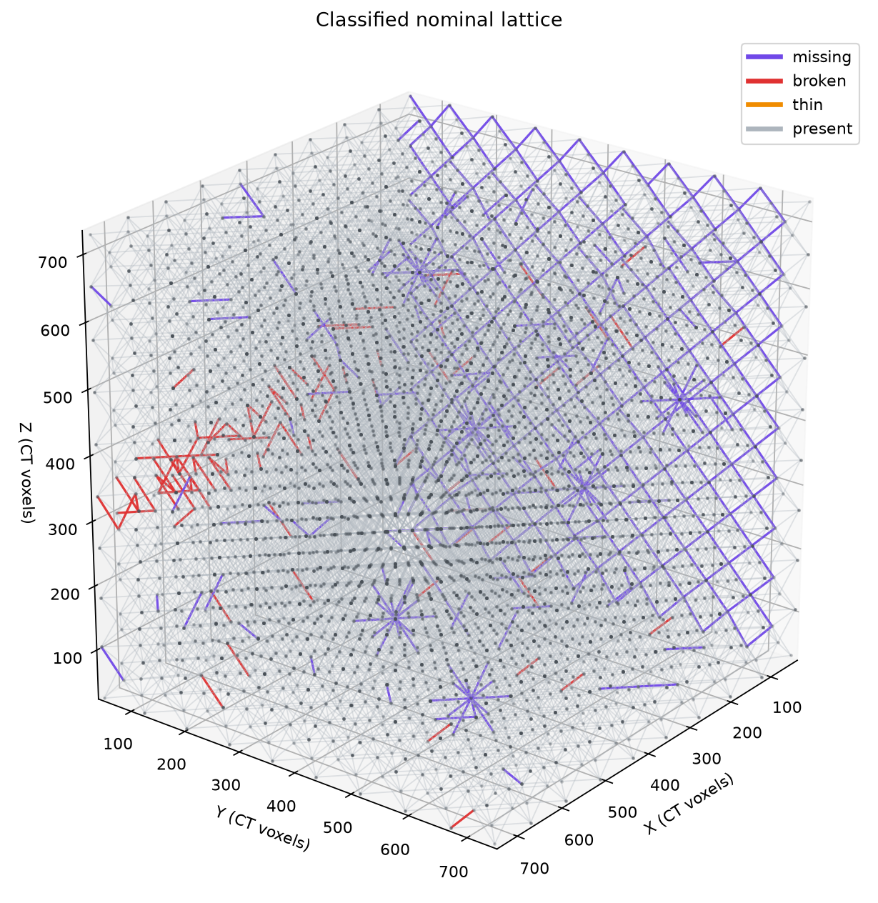
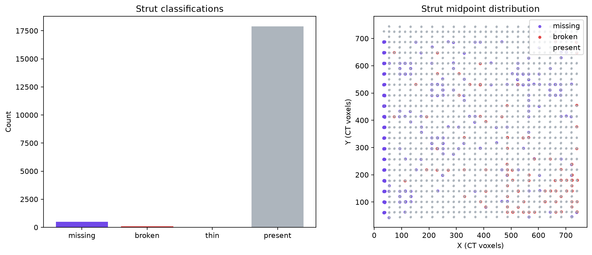

# Nondestructive Evaluation Report — `brian_tran_hackathon`

## Executive assessment

The seal-free Stage 3 report gate is **pass**. The report-scoped lattice contains 18,468 nominal struts: 17,900 present (96.9244%), 479 missing (2.5937%), 89 broken (0.4819%), and 0 thin. In this report, **missing** means that material is absent along a strut expected by the nominal graph; it does not imply an intentional design deletion.

The 568 retained primary defects form 270 graph-connected clusters. The largest cluster contains eight struts. This distribution indicates many spatially separated discontinuities plus several compact multi-strut neighborhoods that merit focused review. Thin and bent analysis was deferred upstream, so the zero thin and bent counts are not evidence that those conditions are absent.

## Scope and artifact basis

This report uses the localized nominal graph, one frozen metric row per nominal strut, and the filtered report classification. No classification, registration, or strut metric was recomputed during reporting. All 18,468 metric regions were valid, the metric row count matched the graph, and the measurement-stage gate passed. The CT foreground threshold recorded in the metric artifact is 42,309.

The primary reporting inputs are:

- `../stage2/localized_graph.json`
- `../stage2/per_strut_metrics.csv`
- `../stage2/per_strut_profiles.json`
- `../stage2/classified_struts_report.json`
- `../stage2/thresholds.json`
- `../stage2/csv/missing_struts_viewer_filtered.csv`
- `../stage2/csv/broken_struts_viewer_filtered.csv`

The reporting tools returned `part2-mcp-response/1.0.0`, `status: ok`, and `gate: pass`. Compact artifact-backed strut reports were retrieved for every retained flagged strut: 479 missing and 89 broken. No thin report calls were required because no thin struts remained in the filtered classification.

## Classification results

| Report class | Count | Fraction of nominal struts |
|---|---:|---:|
| Present | 17,900 | 96.9244% |
| Missing | 479 | 2.5937% |
| Broken | 89 | 0.4819% |
| Thin | 0 | 0.0000% |
| **Total** | **18,468** | **100.0000%** |

The filtered totals crosscheck exactly between `classified_struts_report.json`, `spatial_statistics.json`, the 3D render response, and the viewer-filtered CSVs. The missing and broken counts sum to the 568 primary defects reported by the spatial analysis.

## Materials interpretation

The missing population has a median corridor foreground fraction of 0.00377 and a median maximum axial-gap fraction of 1.0. Its median estimated radius is 0 voxels. Together with the required A-to-B disconnection, these values are consistent with near-complete material absence along affected nominal load paths.

The broken population retains substantially more material: median corridor foreground fraction 0.31485, median maximum axial-gap fraction 0.23529, and median estimated radius 2.236 voxels. This pattern is consistent with local material loss or fragmentation that interrupts end-to-end connectivity while leaving material near the expected strut corridor. By comparison, present struts have median corridor foreground fraction 0.35241, zero median axial-gap fraction, and median estimated radius 2.828 voxels.

The broken class also has a median centerline-curvature RMS of 1.430 voxels versus 0.342 voxels for present struts. This is a metric-level observation only; it is not a bent-strut determination because bent classification was deferred.

## Spatial distribution

The localized graph spans approximately 708.24 × 706.20 × 712.39 voxels. The 568 reportable defects form 270 graph-connected clusters, with a maximum cluster size of eight struts. Representative largest clusters include strut IDs `3480, 3481, 3482, 3483, 3493, 3496, 3499, 3503`; `7424, 7425, 7426, 7427, 7431, 7435, 7436, 7437`; and `8772, 8773, 8774, 8775, 8785, 8788, 8791, 8795`.

The cluster structure should guide follow-up inspection: multi-strut clusters are the more consequential candidates for local loss of stiffness or load-path redundancy, while isolated findings remain important discontinuities against the nominal graph.

## Representative artifact-backed findings

Rows in `missing_struts_viewer_filtered.csv` show that struts 4, 5, 6, 7, and 10 are A-to-B disconnected, have zero central material-slice fraction, and contain longest empty runs of 33–35 slices. These are characteristic examples of the retained missing classification.

Rows in `broken_struts_viewer_filtered.csv` identify severe localized deficits among the retained disconnected-fragment cases. Strut 8502 has central deficit fraction 0.588 and a 16-sample deficit run. Struts 6212, 1992, and 417 have central deficit fractions of 0.529, 0.515, and 0.515, respectively; their longest deficit runs are 14–17 samples. Each retains endpoint material support but lacks an A-to-B material connection.

These examples are illustrative. The complete review scope is the 479-row missing viewer-filtered CSV and the 89-row broken viewer-filtered CSV, and every listed strut was queried through the artifact-backed strut-report interface.

## Report filter and scientific-count limitation

The unfiltered scientific classification remains in `../stage2/classified_struts.json` and contains 500 missing, 902 broken, 17,066 deferred, 0 thin, and 0 present struts. For this report-only view:

- 17,066 deferred cases were mapped to present.
- 789 connected-bite broken cases were mapped to present because the viewer scope requires A-to-B disconnection for broken struts.
- At the nominal crop plane `y = 18`, 21 missing and 24 broken cases were mapped to present.

These remaps produce the filtered totals of 479 missing, 89 broken, and 17,900 present without changing the unfiltered scientific artifact. The crop-plane and connected-bite exclusions are reporting-scope decisions, not evidence that the associated nominal struts are sound. The upstream threshold artifact remains `manual_review` because thin and bent specialist implementations were deferred, and the analysis was label-blind with no training, evaluation, or intentional-deletion labels accessed.

## Recommended follow-up

Prioritize the eight-strut defect clusters and the broken struts with the strongest central deficits for targeted slice review and, where available, mechanical relevance assessment against expected load paths. Retain both filtered and unfiltered classifications in any downstream interpretation: the filtered view supports the current viewer scope, while the unfiltered artifact preserves the broader label-blind scientific findings and deferred-analysis population.

## Generated Stage 3 artifacts

- `spatial_statistics.json` — graph-aware counts, fractions, clusters, class metric medians, bounds, and provenance
- `spatial_statistics.png` — compact spatial summary
- `lattice_3d.png` — classified rendering of all 18,468 nominal struts
- `nde_report.md` — this materials-scientist interpretation
