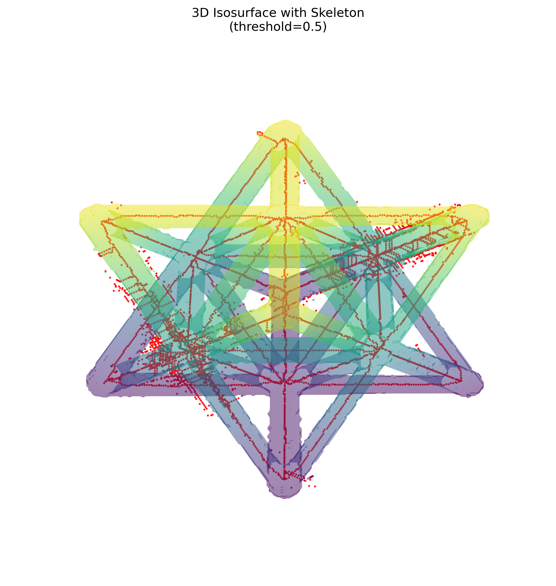
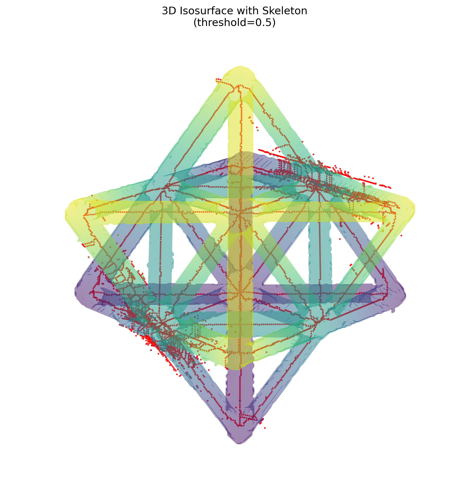

# NDE Report: Octet-Truss Unit Cell

## Scope

This report analyzes the compatible volumetric NumPy files found under `data/unitcell`:

- `unitcell.npy` — reconstructed CT intensity volume
- `unitcell_segmented.npy` — binary material mask generated at an intensity threshold of `0.002`
- `unitcell_skeleton.npy` — 3D centerline skeleton of the mask

All three arrays have shape `256 × 256 × 256`, so their voxels are directly aligned. Other files under `data` are TIFF, STL, JSON, PNG, or text assets and were not included in this `.npy`-based feature report.

## Summary Metrics

| Category | Metric | Result |
|---|---:|---:|
| Volume | Shape | 256 × 256 × 256 |
| Volume | Total voxels | 16,777,216 |
| Volume | Intensity range | −0.003129 to 0.015258 |
| Volume | Mean intensity | 0.000539 |
| Volume | Intensity standard deviation | 0.002418 |
| Mask | Foreground voxels | 847,544 |
| Mask | Foreground fraction | 5.052% |
| Mask / Volume | Mean intensity inside mask | 0.010389 |
| Mask / Volume | Mean intensity outside mask | 0.000015 |
| Skeleton | Skeleton voxels | 5,742 |
| Skeleton | Skeleton-to-mask voxel ratio | 0.677% |
| Skeleton | 26-connected components | 328 |
| Skeleton | Endpoint voxels (1 neighbor) | 341 |
| Skeleton | Branch-point voxels (≥3 neighbors) | 679 |
| Skeleton | Isolated voxels (0 neighbors) | 204 |
| Skeleton / Mask | Skeleton voxels inside mask | 5,742 (100%) |
| Skeleton / Mask | Skeleton voxels outside mask | 0 |

Endpoint, branch-point, and component counts use 26-neighbor connectivity. Branch-point voxels are a local complexity proxy and should not be interpreted as a count of unique physical junctions without graph consolidation.

## Visual Gallery

### View A — elevation 30°, azimuth 45°

### View B — elevation 60°, azimuth 45°

The translucent surface is the binary mask isosurface at level `0.5`; red points show the full-resolution skeleton. Surface extraction used a downsampling factor of two for rendering.

## Analysis

The segmentation isolates a sparse lattice occupying approximately 5.05% of the reconstructed volume. Its mean CT intensity (`0.010389`) is roughly 694 times the background mean (`0.000015`), indicating strong intensity separation between the selected material and surrounding volume at the applied threshold.

Mask-to-skeleton containment is exact at full resolution: all 5,742 skeleton voxels lie inside the segmented region. This supports geometric alignment between the derived centerlines and the material mask. Some red skeleton points appear outside the rendered translucent surface because the surface was downsampled before marching-cubes extraction while skeleton coordinates were retained and rescaled; this is a visualization artifact rather than a containment failure.

The skeleton retains the expected truss centerlines and repeated junction geometry, but its 328 connected components, 341 endpoint voxels, 679 branch-point voxels, and 204 isolated voxels indicate fragmentation at voxel scale. This may reflect discretization, thin-feature loss during segmentation, or the behavior of 3D skeletonization at intersecting members. For topology-sensitive inspection, the next useful step would be graph consolidation followed by component-size filtering and comparison against the nominal unit-cell JSON geometry.

## Method Notes

- Array shapes were checked before feature extraction.
- Intensities were measured from the original `float32` CT volume.
- Mask volume is reported as voxel count because physical voxel spacing was not supplied.
- Skeleton length is likewise reported in skeleton voxels; conversion to physical units requires voxel spacing.
- The two 3D views were generated with the provided NDE `3d_visualize.py` workflow at the required camera angles.
