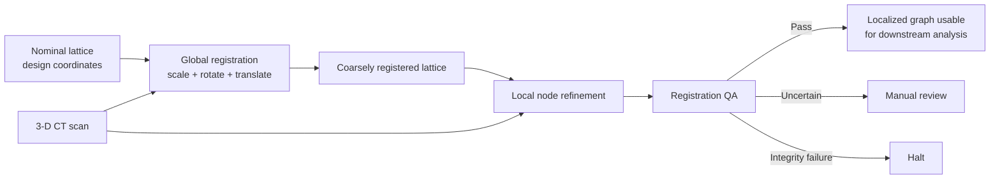
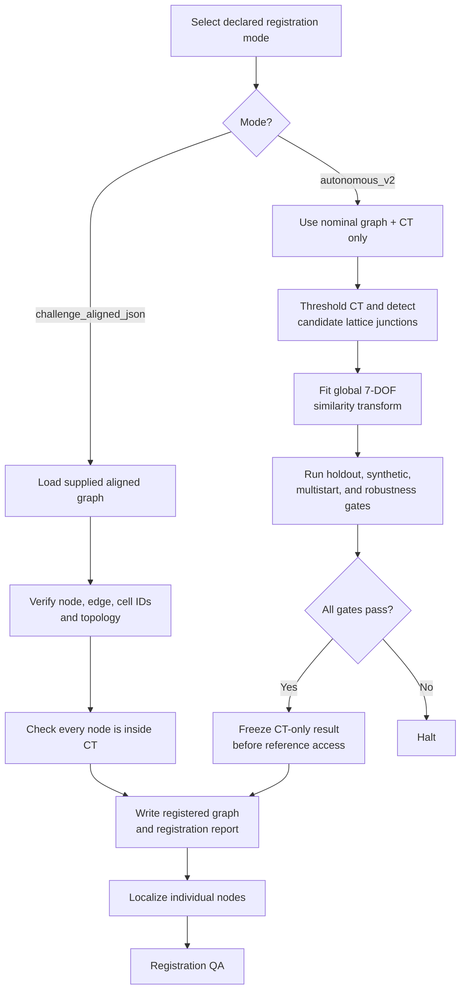
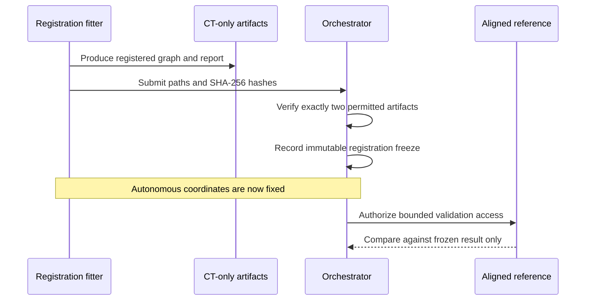

I’m interpreting “registration” as this project’s **lattice-to-CT registration process**: aligning the nominal lattice graph with the physical structure visible in the CT scan.

## Superficial explanation

Registration answers:

> “Where should every CAD/lattice node be placed inside the CT volume?”

The system first performs a **global alignment** of the entire lattice. It then refines each node locally using nearby CT material and finally checks that nodes, struts, and analysis regions are supported by the image.

The important distinction is:

- **Registration** moves the whole lattice into the CT coordinate system.
- **Localization** adjusts individual nodes around that registered prediction.
- **QA** decides which downstream measurements are trustworthy.

---

## The two registration modes

### 1. `challenge_aligned_json`

This is the simpler branch. The challenge supplies a graph whose node coordinates are already expressed in the CT frame.

The code:

1. Loads the nominal and aligned graphs.
2. Confirms their node, edge, cell, and endpoint topology matches.
3. Checks that every aligned node lies inside the CT volume.
4. Copies the aligned coordinates into the registered graph.

It does **not** calculate a scale/rotation/translation transform; the report’s `transform` is therefore `null`. See [registration.py](../src/llnl_nde/core/registration.py#L610).

### 2. `autonomous_v2`

This branch independently estimates alignment from the CT. It is designed to prevent the supplied aligned graph from leaking into the fit.

Before the fit is frozen, the code explicitly rejects any `aligned_graph_path`. See [registration.py](../src/llnl_nde/core/registration.py#L632).

---

## Autonomous registration in detail

### Step 1: Segment the CT

If no threshold is supplied, registration replays the project’s exact per-scan Otsu calculation. Registration stops if the histogram/threshold gates fail.

The result is conceptually:

\[
M(x,y,z)=CT(x,y,z)\geq T
\]

where \(M\) is a binary material mask and \(T\) is the validated threshold.

### Step 2: Detect likely lattice junctions

The detector:

1. Downsamples the CT, normally by a factor of 2.
2. Removes roughly 6.5% from each end of the Z axis.
3. Computes an Euclidean distance transform inside the material mask.
4. Selects regions whose interior radius is at least two downsampled voxels.
5. Labels connected regions and keeps appropriately sized components.
6. Uses each component’s center of mass as a candidate junction.

The result is an unordered point cloud of probable CT junctions. This happens in [detect_ct_nodes()](../src/llnl_nde/core/registration.py#L358).

### Step 3: Create fit and holdout sets

The candidates are deterministically shuffled using a fixed random seed:

- 80% are used for fitting.
- 20% are hidden from the fitter and used to test the result.

This prevents the system from declaring success based only on points it optimized against. See [split_candidates()](../src/llnl_nde/core/registration.py#L335).

### Step 4: Estimate a coarse transform

The detector’s point-cloud bounds and the nominal lattice bounds provide an initial scale and translation. The initial rotation is identity.

### Step 5: Fit a seven-degree-of-freedom transform

The global model is:

\[
\mathbf{x}_{CT}
=
s\left(\mathbf{x}_{design}R^\mathsf{T}\right)+\mathbf{t}
\]

It has seven degrees of freedom:

- 1 uniform scale \(s\)
- 3 rotation parameters \(R\)
- 3 translations \(\mathbf{t}\)

The fitter uses **trimmed iterative closest point**, or trimmed ICP:

1. Transform every nominal node.
2. Find its nearest detected CT candidate.
3. Keep only the closest 70% of correspondences.
4. Recalculate scale, rotation, and translation.
5. Repeat until the residual stops changing or 60 iterations are reached.

Trimming makes the fit less sensitive to missing nodes, defects, and false detections. The implementation is in [trimmed_icp()](../src/llnl_nde/core/registration.py#L191).

### Step 6: Protect against a bad local optimum

ICP is run from 21 starting points:

- 3 scale choices: 0.99, 1.00, and 1.01 times the initial scale
- 7 rotation choices: no perturbation and ±1° around each axis

The best objective wins, but several near-optimal solutions must agree. Their predicted node positions must have a 95th-percentile spread no greater than one voxel. See [multistart_fit()](../src/llnl_nde/core/registration.py#L256).

### Step 7: Apply acceptance gates

The autonomous fit passes only if all of these conditions hold:

- There are enough detected CT candidates.
- The hidden candidates have a median lattice distance of at most 8 voxels.
- Every transformed node lies inside the CT.
- Fit and holdout sets are disjoint.
- Multiple good starting solutions agree.
- The synthetic recovery suite passes.
- The bounded robustness suite passes.

The synthetic suite generates known transforms with noise, 20% missing points, and 25% outliers. At least 90% of its cases must recover the transform within configured scale, rotation, and translation tolerances.

The robustness suite repeats registration under changes to the threshold, downsampling, random seed, distance-transform cutoff, and trimming fraction. At least four variants must succeed, and their predicted nodes must remain within a two-voxel p95 spread.

These gates are assembled in [registration.py](../src/llnl_nde/core/registration.py#L684).

---

## Freezing the autonomous result

After a successful CT-only fit, the registered graph and report are sealed into a hash-bound freeze receipt.

Only after that freeze may the challenge-aligned graph be authorized—and then solely for post-fit validation. It cannot retroactively influence the autonomous solution.

Freeze enforcement and post-freeze authorization are implemented in
`src/llnl_nde/orchestration/pipeline.py`.

---

## Local node refinement

Global registration gets the lattice close, but it does not assume that every manufactured node sits exactly where the ideal design predicts.

For each node, localization:

1. Extracts a CT patch around its registered position.
2. Smooths the thresholded material signal.
3. Runs mean-shift searches from seven seeds: the center and ±X, ±Y, ±Z.
4. Finds the dominant consensus cluster.
5. Scores support at the junction and along its incident strut directions.
6. Accepts the refined point only if consensus, shift, CT support, and boundary checks pass.

If refinement is unstable, the node remains at its global registered coordinate and is explicitly marked `fallback` or `ambiguous`. It is never silently assigned a questionable refined position. See [_localize_one()](../src/llnl_nde/core/localization.py#L363).

---

## Final registration QA

QA evaluates three different kinds of trust:

- **Image support:** Do junction neighborhoods and edge corridors actually contain CT material?
- **ROI capture:** Are the localized positions and padded analysis regions inside the CT?
- **Metrology:** Is the combined global-registration and local-estimator uncertainty small enough relative to the measured strut radius?

The final state is:

- `pass`: downstream outputs are authorized.
- `manual_review`: alignment may be usable, but quantitative localization or metrology evidence is insufficient.
- `halt`: hard image, binding, or ROI integrity checks failed.

Importantly, ROI screening can pass while direct dimensional metrology remains unauthorized. Those decisions are separated in [qa.py](../src/llnl_nde/core/qa.py#L917).
