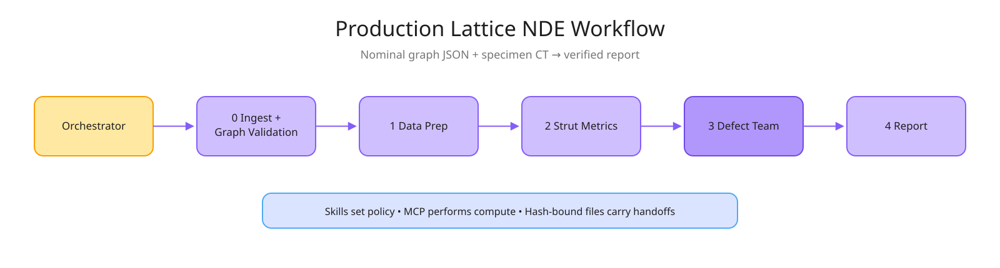
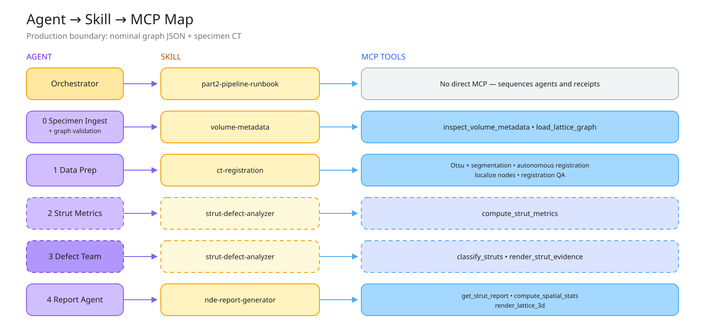

# Part 2 Production Design — Nominal Graph + CT Lattice NDE

## Goal and product boundary

The production system analyzes one specimen from two scientist-confirmed
inputs:

1. a nominal lattice graph JSON containing junctions, struts, and unit cells;
2. the specimen’s three-dimensional CT volume (`.tif`, `.tiff`, or `.npy`).

CAD/STL variants are not required. The system does not infer whether absent
geometry was intentional; it reports evidence relative to the nominal graph.
Training labels, sealed labels, known defects, and ground truth remain outside
the production workflow.

## Architectural principle

Deterministic scientific computation lives behind the required
`segmentation-tools` MCP server. Agents own bounded policy and judgment. The
orchestrator owns sequencing, hashes, access control, and receipts. Large
arrays stay in artifact files and never enter model context.

```text
0 intake + graph validation
  → 1 segmentation, autonomous registration, localization, and QA
  → 2 per-strut metrics
  → 3 label-free defect analysis and independent verification
  → 4 report
```





## Stage 0 — specimen intake and graph validation

`specimen_ingest` confirms the nominal-graph/CT association, records units and
axis declarations, calls `inspect_volume_metadata`, and calls
`load_lattice_graph`. Intake verifies unique explicit IDs, finite positions,
valid strut endpoints, valid unit-cell memberships, graph counts, topology
hashes, CT dimensionality, and file hashes. The normalized nominal graph is a
Stage 0 artifact consumed by Stage 1.

## Stage 1 — data preparation

`data_prep` performs deterministic exact-Otsu segmentation, autonomous
nominal-graph-to-CT registration, independent node localization without a
later global refit, and all-node/all-edge QA. The CT-only fit is frozen before
localization. The axis mapping is pinned as `[x,y,z] → volume[z,y,x]`.

ROI screening and direct metrology remain separate authorizations. Direct
metrology requires artifact-backed absolute uncertainty; otherwise the system
returns `manual_review` or reports metrology as unauthorized.

## Stage 2 — per-strut metrics

`compute_strut_metrics` measures every nominal edge using bounded corridor
sampling. Metrics include occupancy profile, maximum axial gap, local radius,
corridor-local connectivity with junction regions masked, and centerline
curvature. The stage must emit exactly one provenance-bound row per nominal
strut.

## Stage 3 — defect analysis

The defect team evaluates missing, broken/disconnected, thin, and bent
evidence. Production classification is label-free: thresholds come from a
frozen policy and/or specimen population distributions declared by the stage
contract. The merge precedence is `missing > broken > thin > present`; bent is
recorded separately. Every non-present result requires an evidence packet and
the independent verifier must pass before reporting.

## Stage 4 — report

The report stage consumes committed metrics, classifications, evidence, and QA.
`report_agent` invokes the `nde-report-generator` skill. Spatial statistics and
3-D graph rendering run through the production `compute_spatial_stats` and
`render_lattice_3d` MCP tools; cited struts are retrieved through
`get_strut_report`. The report may cite only artifact-backed values and must
pass a deterministic number crosscheck. It must not claim
intentional-versus-unintentional attribution.

## Research evaluation boundary

Historical CAD-variant comparison and labeled benchmarking are research
utilities, not production stages. They may analyze exported copies of frozen
production artifacts, but they cannot change a production manifest, threshold,
classification, receipt, or report. The disabled `segmentation-tools-research`
server is defined in `research/mcp_server.py`, writes only to `research/runs/`,
and is never a production dependency.

## Maintenance invariants

- Production stage numbering is contiguous and fixed at 0–4.
- `analysis/contracts/*.json` is the machine-readable authority.
- Agent prompts and the runbook must match those contracts.
- Stage 0 is the single owner of graph normalization.
- No production contract may require `.stl`, development labels, sealed labels,
  or an aligned graph.
- No stage unlocks until its predecessor receipt and every declared artifact
  are rehashed and verified.
- A deterministic gate failure halts; agents never substitute local compute for
  a missing MCP capability.

See [PIPELINE_MAINTENANCE.md](PIPELINE_MAINTENANCE.md) for the change checklist
and verification commands.
