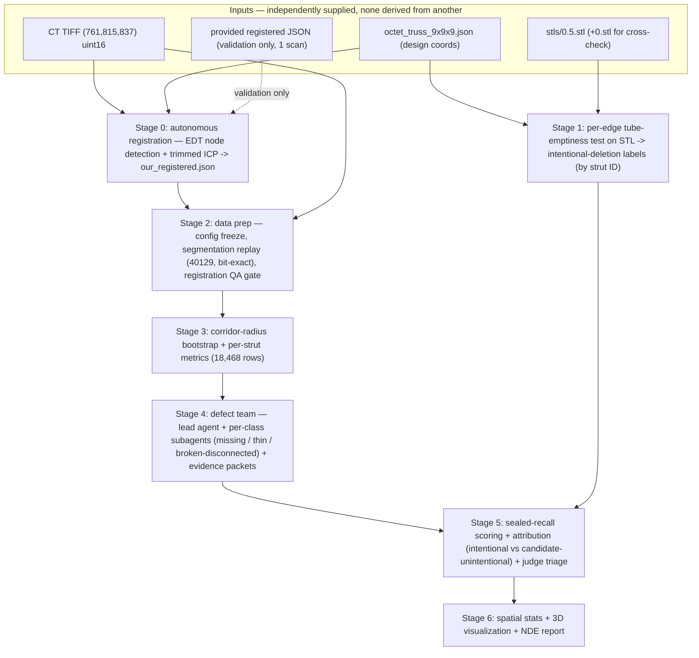

# Part 2 Design — Agentic Missing-Strut NDE Pipeline

**Goal:** a multi-agent system that goes from the `data/missing_struts/` dataset (CT TIFF + registered lattice graph + design STLs) to a per-strut defect table, a traceable NDE report, and a 3D defect visualization, with a closed evaluation loop. This document is the frozen design: architecture, pipeline stages, MCP tools, subagent contracts, skills, and the eval layer.

This design was produced by reviewing every existing component (MCP server, skills, subagents, notes, evals), **verifying the data itself by running code against it** (Section 1), and then passing the draft through an adversarial design review whose fixes are folded in below.

---

## 1. Verified data facts (ground truth for this design)

All numbers below were measured directly from the files in this repo (not taken from notes or briefings).

### 1.1 The CT volume

- `data/missing_struts/tif_stacks/210127_Brian_Tran_strut_lattices_0point5dash1 1 Slices.tif`: **761 pages × (815 rows × 837 cols), dtype uint16, big-endian (`>u2`), ImageJ-written, series axes `ZYX`**, ~990 MiB. No voxel-size metadata in the TIFF.
- **It is md5-identical to `data/9x9x9_octet_lattice/9x9x9_octet_lattice.tif`** — the repo carries the same scan twice, and all Part 1 segmentation work on the latter applies verbatim to the former.
- Full uint16 load ≈ 7 s, ~1.04 GB in RAM. Never cast the whole volume to float (2.1–4.2 GB).
- Edge slices are atypical (slice 0 mean 49,093 and slice 760 mean 44,759 vs slice 380 mean 33,068) — exclude edges from global statistics.

### 1.2 ⚠ Threshold correction: **40129, not 40049**

The "frozen Otsu 40049" recorded in our working notes **appears nowhere in the repo** — every grep hit for `40049` is a coordinate-float substring inside the registered JSON (e.g. `762.6400495…`). The only recorded, reproducible threshold is in `data/9x9x9_octet_lattice/segmentation/report.md`:

- **Frozen rule: `input >= 40129`** (sampled Otsu baseline 40705, lowered by the continuity refinement), producing **exactly 58,324,474 foreground voxels (11.235 %)**.
- Empirically 40049 behaves nearly identically (~4.95 % of the middle slice foreground either way), so no conclusion changes — but 40129 is the value with provenance, and the pipeline freezes it with a bit-for-bit replay gate.
- The mask itself (`mask.tif`, ~495 MB) is **gitignored and absent**: the frozen segmentation is a *recipe*, not a file. Stage 2 regenerates it deterministically.

### 1.3 ⚠ Axis mapping (silent-failure hazard)

Registered-JSON positions are `[x, y, z]`; the numpy array is `(Z, Y, X) = (761, 815, 837)`. **Correct sampling is `vol[round(z), round(y), round(x)]`.** Validated empirically: 94.5 % of 200 random registered junctions hit foreground within a 5×5×5 neighborhood (89.9 % at the exact voxel, median intensity 52,296; measured at threshold 40049 — Stage 2 re-measures at the frozen 40129 and records that value as the gate baseline). Every plausible wrong mapping scores far worse (2.1–67.1 %), and `vol[x][y][z]` **goes out of bounds** (x max 773.7 > 761 pages). The briefing's "837×815×761" is X-by-Y-by-Z, i.e. reversed from numpy order. This mapping is pinned in the config and inside the corridor-sampling tool — no agent ever indexes the raw array from prose instructions.

### 1.4 The lattice graphs

- `octet_truss_9x9x9.json`: keys `junctions` / `struts` / `unit_cells` (note: `unit_cells`, not `cells`); **10,206 junctions, 18,468 struts, 729 unit cells**; junction ids 0–10,205 and strut ids 0–18,467 sequential; all junction pairs unique; nominal coordinates span exactly [0, 18] per axis; every strut has `thickness = 0.1` (design units).
- Registered JSON: **identical structure, counts, and topology, field-by-field** — only junction `position` values differ (spans X 58.76–773.74, Y 48.57–764.94, Z 24.50–737.85). **Therefore strut labels derived in design space transfer 1:1 to CT space by strut ID** — no coordinate mapping needed for label transfer.

### 1.5 The STLs

- All four are **binary** STL: `0.stl` = 3,514,642 triangles; `0.1.stl` = 3,511,458; `0.5.stl` = 3,498,656; `1.stl` = 3,482,368. Triangle deficits vs `0.stl` (3,184 / 15,986 / 32,274) are **~174–177 triangles per removed strut** assuming ~18 / 92 / 185 removed struts (0.1 / 0.5 / 1 % of 18,468) — a highly consistent ratio that serves as a built-in consistency check.
- `trimesh` loads one in ~5 s with `process=False`. Units are **mm, origin-centered** (bounds ± ~20.7 mm in X/Z), unlike the 0–18 nominal frame. **The Y extent is 51.04 mm vs 41.49 mm in X/Z — the STL contains ~9.5 mm of extra non-lattice geometry (tabs/plates) along Y.** Bounding-box registration is therefore forbidden; the mm→design transform must be fitted on lattice geometry only.
- Scale: 41.493 mm / 18 design units = **2.3052 mm per design unit** (unit cell ≈ 4.61 mm vs README's 4.56 mm, ~1 % off). Combined with registered spans (39.72 voxels/design unit) this implies **~58.0 µm per voxel**, consistent with the externally-claimed 58.09 µm — which is otherwise recorded **nowhere** in the repo and must be treated as an external constant.

### 1.6 ⚠ Strut diameter ambiguity

JSON `thickness = 0.1` design units ≈ **231 µm**, which matches neither the README's 350 µm (≈ 6.03 voxels) nor the paper-derived 424 µm noted in `notes/CHALLENGE_NOTES.md`. **Never use JSON thickness as a physical diameter.** The pipeline derives the nominal radius empirically (Stage 4 bootstrap, §4) and reports all three candidates.

### 1.7 The registration is an exact global similarity transform (recovered)

The repo contains no registration code or metadata — the registered JSON was supplied pre-aligned. Fitting registered = M·nominal + b over all 10,206 junction pairs recovers it **exactly (residual 0.0000 voxels on every junction)**: the registered graph is the nominal graph under one global 7-parameter similarity transform, not a per-node measurement.

- **Uniform scale 39.4888 voxels/design unit** (all three singular values identical — no anisotropy or shear)
- **Rotation 0.335°** (the part sat almost axis-aligned in the scanner)
- **Translation (59.34, 52.18, 26.46)** voxels in (x, y, z)

Implications: (a) registered positions are **as-designed mapped into CT space, not as-printed** — local print deviation is unmodeled, which is why exact-voxel junction hits are 89.9 % but 5×5×5 hits are 94.5 %; corridor sampling must keep its tolerance radius. (b) A better voxel-size derivation: 2.3052 mm/unit ÷ 39.4888 vox/unit = **58.38 µm/voxel** (config records this fit-based value alongside span-derived ~58.0 and the external 58.09). (c) STL→CT registration is nearly free if ever needed: compose STL-mm→design with this recovered matrix. The recovered M, b, and the one-line least-squares derivation go into `analysis_config.json`.

**Autonomous reproduction (Stage 0).** The recovery above fits the *provided* registered JSON — i.e. it uses the answer, so it proves the target is a clean similarity transform but is not itself autonomous. A working POC ([poc/ct_registration/](../poc/ct_registration/)) now reproduces the transform **from CT intensities alone** — EDT node-peak detection (junctions are thicker than struts → local maxima of the distance transform; this is a local per-candidate distance-transform search, **not** whole-volume skeletonization, which stays demoted per §3.2) → 70 %-trimmed correspondence-free ICP → Umeyama similarity update — never reading the provided JSON during fitting. Held-out validation: **median per-node error 3.68 voxels**, scale within 0.78 %, rotation within 0.057°, 92.2 % junction 5×5×5 foreground — all gates pass in ~15 s. This promotes registration from a supplied input to an autonomous **Stage 0** (§3, §4), removing the last human-supplied alignment dependency from the loop; the provided registered JSON is retained as a validation upper bound only.

**⚠ Two different kinds of "gate" here — do not conflate them.** Only one of the five numbers above is computable on a CT scan that has no answer key: **junction 5×5×5 foreground occupancy** (does the fitted graph actually land on material?) is measured from the CT alone and is what the pipeline can gate on in general. The other four (median node error, scale/rotation/translation error) require the held-out *provided* registered JSON — which exists for exactly **one** scan in this entire dataset (`registered_jsons/` has a single file, §1.4). So those four are a **validation-only bonus**, reported whenever a ground truth happens to be available, never a blocking condition. §3.1, §3.2, and §4 state the blocking gate as ICP-residual convergence + foreground occupancy only, precisely so Stage 0 still works on a scan nobody has pre-registered.

---

## 2. Current-state review (what exists, what's missing)

| Component | Exists today | Part 2 gap |
|---|---|---|
| **MCP server** (`src/mcp_server.py`) | 3 fully implemented tools (`segment_ct_dataset`, `visualize_slice`, `skeletonize`), good hygiene (allow_pickle=False, Agg backend, stdout kept clean for JSON-RPC, errors returned as strings) | `.npy`-only — **cannot open the TIFF, the graphs, or the STLs**, i.e. every Part 2 input; no per-strut primitive, no thickness measurement, prose-only returns |
| **Skills** (`.agents/skills/`) | `ct-threshold-optimizer`, `npy-metadata-extractor`, `nde_report_expert` | All `.npy`/Part-1 centric; threshold sweeping conflicts with the frozen threshold; NDE report template has no per-strut table; `nde_report_expert` dir name mismatches its frontmatter (`nde-report-generator`), breaking name resolution; `3d_visualize.py` would blow memory on this volume |
| **Subagents** (`.codex/agents/`) | One: `segmentation_agent.toml` — an excellent bounded contract (exact inputs, GT prohibition, enumerated artifacts, 10-iteration/3-failure limits, self-verification) | Only one agent; it mandates fresh exploratory optimization (contradicting the frozen threshold); it's Codex-TOML/platform-specific. **Port the contract skeleton, not the file.** |
| **Evals** (`evals/`) | One LLM-judge rubric (well-written) + one single-sample result (4/5); `verification.json` checks format only | No objective metrics at all; no repeats/calibration/metadata; single-slice coverage; **the dataset's one exact ground truth (STL diff → intentional deletions) is unused** |
| **Notes** | `notes/CHALLENGE_NOTES.md` is current and good | Root `STUDY_NOTES.md` is a stale truncation that dies mid-heading — a context-poisoning hazard; replace with a pointer |
| **Deps** (`requirements.txt`) | numpy, matplotlib, fastmcp, scikit-image, tifffile (unpinned; tifffile never imported under `src/` — only by `scripts/` and the committed `segment_ct.py`, which also imports the un-declared scipy) | Add **scipy, trimesh, pandas, pyvista**; pin versions |

---

## 3. Architecture

**Principle: deterministic heavy compute lives in MCP tools; judgment lives in bounded subagents; all hand-offs are files.** Agents never pass arrays through context — every stage reads and writes artifacts under `data/missing_struts/analysis/`, and the orchestrator gates each stage on the previous stage's verification block.

**Inputs are independent, not a pipeline of one deriving another.** The CT TIFF, the design STLs, and `octet_truss_9x9x9.json` (the nominal node/edge graph) are three separately-supplied dataset artifacts (README's own "Dataset Contents" list) — nobody derives the graph JSON from the STL or vice versa; they describe the same nominal lattice in two different representations (surface mesh vs. graph), and only the *design→CT transform* connects either of them to the TIFF.

**In graph terms:** intentional missing = G_full − G_0.5-design (Stage 1); candidate unintentional defects = G_0.5-design − G_observed-CT after removing the intentional set (Stage 5). The topology identity verified in §1.4 is what makes Stage 1's labels transfer to CT space by strut ID alone.

### 3.1 Subagents and contracts

Every subagent gets a contract modeled on `segmentation_agent.toml`'s proven skeleton — exact inputs, a never-touch list, enumerated output artifacts, iteration/failure bounds, and a mandatory self-verification JSON — ported to the orchestrating platform (the TOML itself is Codex-specific and stays as reference). The roster is deliberately lean everywhere **except Stage 4**, which is the scientific heart of the pipeline: there, a dedicated `defect_lead` agent runs one subagent per defect class, so each class's detection logic, cutoffs, and justification are owned by a specialist with a narrow contract (and the classes' very different supervision situations — §5.2 — stay cleanly separated). Elsewhere, agents exist only where there is judgment to exercise; purely deterministic stages are tool invocations sequenced by the orchestrator.

| Agent | Stage | Contract highlights |
|---|---|---|
| `orchestrator` | all | Sequences stages strictly through file artifacts; verifies each stage's self-verification before unlocking the next; max 2 retries per *agent* stage (deterministic gates either pass or halt — no retry thrash); maintains `analysis/manifest.json` (stage status + artifact hashes + config hash); owns the final presentation/demo assets |
| `registration` | 0 | Derives the design→CT similarity transform **from CT intensities alone** (EDT node-peak detection → 70 %-trimmed correspondence-free ICP → Umeyama); **forbidden to read the provided registered JSON during fitting** — it is opened only after `our_registered.json` is frozen, for validation. Emits `registration/our_registered.json`, `registration/fitted_transform.json`, `registration/validation.json`, and a self-verification block; **blocking gate is ground-truth-free** (ICP trimmed-residual convergence + junction 5×5×5 foreground ≥ 85 %, both computable from the CT alone, so this works on any scan); the §1.7 median-node-error/scale/rotation/translation numbers are logged as a **validation-only bonus** whenever a provided registered JSON happens to exist (true for exactly one scan today) but never block the gate. Same 2-retry bound. Ported from the working POC (`poc/ct_registration/`) |
| `design_diff` | 1 | Works **only in design space**; bounding-box registration forbidden; must pass the count-consistency gate before labels propagate; flags (never guesses) ambiguous edges and reports them in `label_report.md` |
| `data_prep` | 2 | Freezes `analysis/config/analysis_config.json` (provenance class per constant: verified / derived / external / open); **replay, not exploration** — runs the recorded segmentation recipe with the bit-for-bit foreground gate (58,324,474); runs registration QA on **all** edges; emits the x-binned bias curve; fixes notes hygiene; never touches ground-truth labels |
| `strut_metrics` | 3 | Never sees the labels; runs the corridor-radius bootstrap, then `compute_strut_metrics`; verifies 18,468 rows |
| `defect_lead` | 4 | **Dedicated defect-analysis agent** coordinating one subagent per defect class (below). Fans the per-strut metrics out to its subagents, adjudicates conflicts under a fixed precedence (**missing > broken > thin > present** — each strut gets exactly one label), merges the per-class findings into `classified_struts.json`, generates evidence packets for every non-present strut, and writes the merged `decision_log.md`. **Blind:** the team as a whole sees metrics + dev-split labels only; the lead never overrides a subagent silently — every adjudication is logged |
| ├ `missing_strut_agent` | 4a | Sole subagent allowed to read `dev_split.json`. Calibrates the missing/present occupancy boundary on the ~27 dev positives; outputs `findings_missing.json` + its own decision log; forbidden to touch thin/broken cutoffs |
| ├ `thin_strut_agent` | 4b | **No labels exist for this class** — cutoffs distribution-derived (percentiles of median/min EDT radius vs the Stage 3 empirical nominal radius); outputs `findings_thin.json` with justification; forbidden to read any label file |
| ├ `broken_strut_agent` | 4c | Owns broken **and disconnected-at-joint** (the Tran et al. class): max-axial-gap profile + corridor-local connectivity with junction spheres masked out; distribution-derived cutoffs; outputs `findings_broken.json`; forbidden to read any label file |
| ├ `classifier_verifier` | 4d | **Independent process check on the whole defect team, run last, before the one-shot sealed scoring.** Sees only metrics, per-class findings, evidence packets, `decision_log.md`, `thresholds.json`, and the dev split — sealed split forbidden; did not participate in any classification decision. Verifies that (a) each non-present call's evidence packet actually supports it (e.g. a "broken" call shows an axial gap in its occupancy profile), (b) each subagent's cutoffs follow from the dev-split / population distributions as claimed, not post-hoc cherry-picks, (c) the lead's merge respected the fixed precedence and every adjudication is logged, and (d) `decision_log.md` matches what `classify_struts` executed. Writes `struts/verifier_report.json` with its own self-verification JSON; the orchestrator gates Stage 4 → 5 on it (same 2-retry bound). Stage 4 is the only stage with a dedicated verifier because it is the only place where subjective judgment feeds directly into the unrepeatable sealed evaluation (§5.4) |
| `eval_agent` | 5 | **Sole owner of the sealed split.** Scores sealed recall (one shot, §5.4), produces the final intentional-vs-unintentional attribution table, runs judge triage on candidate unintentional defects |
| `report_agent` | 6 | Computes spatial statistics via `compute_spatial_stats` (seeded), renders the 3D defect visualization, then compiles the report. **Report text is recompute-free: every number cited from a committed artifact**; the number-crosscheck script runs before the judge rubric |

### 3.2 MCP server v2 (`src/mcp_server.py` extended)

Reused: `segment_ct_dataset`, `visualize_slice` (both generalized to accept `.tif/.tiff` via a shared `_load_volume` — which removes any need for a separate TIFF→npy conversion tool; structured dict returns added alongside status strings). Demoted: `skeletonize` — corridor sampling replaces whole-volume skeletonization on the critical path; keep as optional per-subvolume QA cross-check (and fix `skeletonization.py`: raise instead of returning None, `allow_pickle=False`, no double load).

New tools:

| Tool | Purpose |
|---|---|
| `volume_info` | TIFF/npy metadata + per-slice stats + histogram/percentiles (memmap-aware, big-endian-safe, quote-safe paths) |
| `load_lattice_graph` | Parse either JSON; verify 10,206/18,468/729 and spans; emit normalized nodes/edges/cells `.npz` |
| `register_ct` | **Stage 0 engine.** Detects lattice nodes as EDT local maxima on the thresholded CT (factor-2 downsample for speed/memory) — a local per-candidate distance-transform search, **not** whole-volume skeletonization — fits a 7-DOF similarity transform to the design graph via trimmed correspondence-free ICP with an Umeyama update, and writes `our_registered.json` (all 10,206 nodes in CT coords, provided-JSON schema). Self-checks on CT-intrinsic signals only (ICP residual, junction foreground occupancy). **Never reads the provided registered JSON during fitting** — that file is opened only by a separate, optional validation path, when one happens to exist for the scan. Ported from the working POC (`poc/ct_registration/register_ct.py`) |
| `label_deleted_edges` | Step (a) engine — **tube-emptiness test, not a mesh diff** (§4 Stage 1): for each of the 18,468 design edges, test whether the k% STL has any triangles within a small tube of the scaled centerline; a strut is deleted iff its tube is empty. Needs only scale (2.3052 mm/unit) + centroid translation — no clustering, no exact-float triangle matching, and it degrades gracefully. Triangle-deficit counts (§1.5) remain the independent consistency gate. |
| `compute_strut_metrics` | **The core Part 2 primitive.** Reads the frozen mask + registered graph and, for each of the 18,468 registered edges, samples a cylindrical *corridor* around the strut centerline (radius from the Stage 3 bootstrap, **not** a hard-coded guess) and emits five per-strut metrics, each targeting one defect class: • **corridor occupancy profile** — foreground fraction sampled along the strut axis → low occupancy flags **missing** • **max axial gap** — longest run of empty cross-sections → large gap flags **broken** • **EDT local radius** — Euclidean-distance-transform radius along the strut → small radius flags **thin** • **corridor-local connectivity** — connected components on the per-strut subvolume with junction spheres masked out → detects **disconnected-at-joint** (a whole-mask CC check is useless: the lattice is one giant component) • **RMS curvature** — per axial cross-section, Otsu-segment the corridor slice and fit an ellipse → centroid; the centroid polyline is the measured centerline, and its RMS curvature flags **bent** struts (the one class the other four metrics miss) **Axis map `[x,y,z]→vol[z,y,x]` pinned inside the tool.** The ellipse-fit-centerline → curvature approach is adopted from LatticeAnalytics (§3.4), which showed an RMS-curvature histogram cleanly isolates bent struts. |
| `classify_struts` | Applies agent-chosen cutoffs deterministically; records thresholds verbatim in the output |
| `compute_registration_qa` | Corridor-foreground fraction over **all** edges (global + x-binned; ≤ 0.5 % contamination from deletions moves the baseline negligibly — no label access needed), junction hit rates, independent voxel-size estimate |
| `compute_spatial_stats` | Cell-shell defect rates, cKDTree nearest-neighbor + seeded permutation tests |
| `render_strut_evidence` | Evidence packets: three orthogonal CT crops centered on a strut + occupancy/intensity profile plot (generated at Stage 4; consumed by Stage 5 triage and embedded by Stage 6) |
| `render_lattice_3d` | Offscreen PyVista render of the **design graph** (18k line segments — not the 1 GB volume) colored by defect class; the report hero figure and demo asset, answering the README's visualization emphasis |
| `compute_detection_metrics` | Eval-side **recall only** (strict + lenient, with Wilson CI) + 4-class confusion matrix vs sealed labels; invoked only by `eval_agent` (§5.3 explains why precision/F1 are not computed) |

### 3.3 Skills

- **`strut-defect-analyzer` (NEW):** owns Stages 3–4; documents the registered-JSON schema, the pinned axis mapping, the corridor-radius bootstrap, the corridor-local connectivity method (and its limitation: sub-voxel lack-of-fusion is undetectable at 58 µm/voxel), and dev/sealed label discipline.
- **`stl-design-diff` (NEW):** owns Stage 1; documents that STLs are mm, origin-centered, unregistered, with extra Y geometry; the tube-emptiness method; labels transfer **by edge ID only**.
- **`volume-metadata` (upgrade of `npy-metadata-extractor`):** TIFF support, histogram for threshold sanity; config file becomes the sanctioned source of voxel size.
- **`ct-threshold-optimizer` (upgrade, off critical path):** add a frozen-threshold verify/replay mode (40129, expected fg 58,324,474); keep sweeping as demo fallback.
- **`nde-report-generator` (upgrade of `nde_report_expert` + directory rename to match frontmatter):** Part 2 template — per-strut findings table, blind-findings vs attribution-appendix structure (§5.1), spatial stats, 3D figure, methods/provenance pinning the config hash; drop the "delete your scripts" rule; fix `3d_visualize.py` (argparse, mmap, downsample ≥ 4).
- **`part2-pipeline-runbook` (NEW, orchestrator-facing):** stage order, artifact paths, gate conditions, retry policy, presentation checklist.

### 3.4 Relation to LatticeAnalytics

LatticeAnalytics (Miao et al., *IEEE TVCG*, Oct 2025 — the same LLNL group: Giera, Bremer, Guss et al.) is the closest prior work, and it maps cleanly onto our substrate rather than competing with it. It solves the **infrastructure** half of the lattice-CT workflow: OpenVisus multi-resolution storage with per-strut subvolume queries (the same embarrassingly-parallel, O(#struts) processing model we use), VR-guided coarse registration plus automatic intensity-peak fine registration, per-strut extraction (rotated-cuboid subvolume, z-normalization, Otsu segmentation, ellipse-fit cross-sections → centerline → curvature/aspect-ratio metrics, plus a Python API for custom metrics), and an interactive dashboard with Contour View and Roughness Map. Its stages ≈ our **Stages 0–3** (registration, data, metrics); we take its metric machinery as given, but unlike LatticeAnalytics we do **not** depend on human-guided (VR) registration — our autonomous Stage 0 recovers the design→CT transform from CT intensities alone (§1.7, §4), matching the supplied alignment to 3.68-voxel median error without ever reading it.

What LatticeAnalytics **deliberately does not do** is the autonomous-analysis half that is our contribution. It is proudly human-in-the-loop: metrics are computed, then a human expert eyeballs histograms, selects outlier bins, and visually adjudicates each candidate (their own note: any artifact biases toward false positives, "which the expert can quickly disregard"). There is no automated classification with calibrated cutoffs, no blinded/sealed evaluation (their validation is 5 known defects in a simulated lattice + expert interviews), no intentional-vs-unintentional attribution (they never diff design STLs), and no generated NDE report. Those are exactly our **Stages 4–6**: the defect team with justified cutoffs, the `classifier_verifier` audit, one-shot sealed-recall scoring with Wilson CI (§5.4), judge triage of evidence packets, and the recompute-free report. The lead author's stated future direction — "autonomous visualization agents to accelerate defect detection" — is the layer this design builds. Concretely we borrow one metric from them (the ellipse-fit-centerline RMS curvature in §3.2, to cover bent struts) and position our pipeline as the autonomous analyst sitting on top of a LatticeAnalytics-style substrate.

### 3.5 Non-goals: what stays out to keep the loop autonomous

**The primary design goal is a fully autonomous agentic loop** — from raw inputs (TIFF + graphs + STLs) to scored defect table and NDE report — that closes without a human in the loop. The loop is: metrics → classify (defect team) → `classifier_verifier` audit → sealed scoring → report, with the orchestrator gating every stage on the prior stage's self-verification JSON and retrying agent stages up to 2× (§3.1). The `classifier_verifier` (§3.1) is the machine substitute for the human who, in LatticeAnalytics, eyeballs the dashboard and adjudicates each candidate.

To protect that autonomy, the following LatticeAnalytics capabilities are **explicit non-goals** — each is a human-in-the-loop touchpoint or infrastructure that would break the closed loop, not a feature we lack the means to build:

| Non-goal | Why it is excluded |
|---|---|
| **VR-guided alignment** | Requires a person in a headset per dataset. Replaced by autonomous **Stage 0** registration (EDT node detection + trimmed ICP), which recovers the design→CT transform from CT intensities alone — median 3.68-voxel error vs the held-out ground truth, no human alignment step (§1.7, §4). |
| **Contour View / Roughness Map dashboard** | Their entire purpose is to let a *human* visually scan the histogram tail and adjudicate candidates. Our equivalent adjudication is automated (calibrated cutoffs + `classifier_verifier` + judge triage of evidence packets). Static evidence crops and the 3D render suffice for the demo. |
| **OpenViSUS multi-resolution streaming** | Infrastructure for interactive human browsing of very large (91 GB) volumes over a network. Irrelevant to a headless agent processing a 1 GB local volume; memmap reads and per-corridor subvolumes (§6) handle memory. |
| **Interactive Plotly/Dash web UI** | A UI implies a user. The deliverable is machine-generated artifacts (metrics CSV, classified JSON, NDE report, 3D figure), not a browsable app. |

These are exclusions of *interaction surface*, not of *capability*: the underlying metric and registration machinery (ellipse-fit centerline, corridor sampling, similarity transform) is retained — see §3.4. Anything requiring a human judgment call is either automated (Stage 0 registers the design graph to CT from intensities alone, replacing VR alignment) or replaced by a bounded agent with a logged, auditable contract.

---

## 4. Pipeline stages, artifacts, and milestones

All pipeline outputs live under `data/missing_struts/analysis/`; eval-owned artifacts (sealed split, rubrics, results, harness) live under repo-root `evals/` to keep them physically separate from what upstream agents touch. Large binaries are gitignored and regenerable; everything else is committed. Milestones are numbered in execution order and each is independently demoable.

| Stage | Milestone | In → Out (key artifacts) | Gate |
|---|---|---|---|
| 0 autonomous registration | **M0** — our registered graph overlays CT foreground | TIFF + nominal JSON → `registration/our_registered.json`, `registration/fitted_transform.json`, `registration/validation.json` (ground-truth-free self-check; vs held-out GT only when available), `registration/registration_error_hist.png` | **Blocking (any scan):** ICP trimmed-residual converged; junction 5×5×5 foreground ≥ 85 %. **Validation-only bonus (this scan only):** median node error < 5 vox; scale within 1 % of 39.489. **Provided JSON never read during fitting** |
| 1 intentional-deletion labels | **M1** — "here are the ~92 struts LLNL deleted, from design files alone" | `0.5.stl` (+`0.stl`, `0.1.stl`, `1.stl` cross-checks) + nominal JSON → `labels/intentional_deletions_{0p1,0p5,1p0}.json`, `label_report.md`; then a **stratified** 30/70 split (by x-bin and z-shell) → `labels/dev_split.json` + `evals/labels/sealed_split.json` | counts ≈ 18/92/185, monotone, tri-deficit ratio 170–180 |
| 2 data prep (config + replay + registration QA) | **M2** — junction overlay on fresh mask | TIFF + registered JSON → `config/analysis_config.json`, `segmentation/mask.tif` (gitignored), `replay_report.json`, `slice_380.png`, `qa/registration_qa.json`, `qa/bias_by_x.png` | fg == 58,324,474 bit-for-bit; junction 5×5×5 foreground ≥ 90 % **re-measured at 40129** and recorded as the baseline; HALT on fail |
| 3 corridor bootstrap + metrics | **M3** — sortable metrics table, worst-20 struts visualized | mask + graph npz + config → `struts/corridor_calibration.json` (empirical EDT radius from a sample of high-occupancy struts → corridor radius, recorded in config), `struts/per_strut_metrics.csv` | exactly 18,468 rows |
| 4 blind classification (defect team) | — | metrics + dev labels + config → per-class `struts/findings_{missing,thin,broken}.json` (from the three class subagents), merged `struts/classified_struts.json` + `thresholds.json` + `decision_log.md` (from `defect_lead`, precedence missing > broken > thin > present), `evidence/strut_<id>/` packets for every non-present strut, `struts/verifier_report.json` (from `classifier_verifier`) | every strut labeled exactly once; every lead adjudication logged; `classifier_verifier` sign-off (sealed-split-blind evidence/cutoff/merge/log audit) required before Stage 5 unlocks |
| 5 sealed scoring + attribution + triage | **M4** — confusion matrix: "found X of 65 sealed deletions (CI), plus Y candidate unintentional defects with CT evidence" | classifications + sealed labels → `evals/results/<timestamp>.json` (recall + Wilson CI + confusion matrix), `struts/attributed_struts.json` (final intentional/unintentional table), `triage/triage_results.json` | **one-shot protocol** (§5.4); reporting, not pass/fail |
| 6 spatial stats + 3D viz + NDE report | **M5** — the deliverable | all artifacts (read-only) → `spatial/spatial_stats.json` + figures, `report/lattice_defects_3d.png`, `report/nde_report.md` | number-crosscheck script passes; judge rubric on report prose |

**Explicit MVP cuts:** full STL surface→CT registration (Stage 0 autonomously registers the *design graph* to CT via node detection; the STL tube test needs only scale + centroid, §1.5), adaptive thresholding (bias handled by the Stage 2 curve + recorded normalization), whole-volume skeletonization, threshold sweeps, full analysis of the 0.1 %/1 % designs (count cross-checks only — no CT exists for them in this repo), interactive dashboards (static 3D render + slice overlays suffice for the demo).

---

## 5. Evaluation layer

**Objective wherever ground truth exists; LLM-as-judge only where it doesn't.** The one exact ground truth this dataset offers is the intentional-deletion list — and it labels only the *missing* class. The eval layer is honest about exactly what that supervises.

### 5.1 What is blinded, and what the split proves

The labels' *existence* is public (Stage 1 commits `label_report.md`); what is blinded is **classifier calibration**: within the Stage 4 defect team, only `missing_strut_agent` reads the 30 % dev split (the thin/broken subagents and the lead are label-free by contract), and the sealed 70 % (~65 struts) is read once, by `eval_agent`, at Stage 5. Blinding is **procedural, not cryptographic** — any agent could re-derive the labels — so the contracts state the prohibition explicitly and the manifest records which agent read which label file. Consequences for the report: Stage 6's report is two-part — *blind findings* (what the pipeline detected, before unsealing) and an *attribution appendix* (the final intentional-vs-unintentional table, produced by `eval_agent` at Stage 5). This avoids the trap of a "candidate unintentional" table that is 70 % sealed intentional deletions.

### 5.2 What supervises which class

The per-class subagent split of Stage 4 mirrors this supervision asymmetry directly:

- **missing / present boundary** (`missing_strut_agent`): calibrated on the ~27 dev positives; scored on the ~65 sealed positives.
- **thin / broken / disconnected** (`thin_strut_agent`, `broken_strut_agent`): **no ground truth exists.** Cutoffs are distribution-derived (percentiles of EDT radius and max-gap over the population), justified in each subagent's findings file and the merged `decision_log.md`, and validated only via judge triage of evidence packets — never via detection metrics.

### 5.3 Objective metrics: recall, not precision

`compute_detection_metrics` reports **recall** (strict = missing only; lenient = missing ∪ broken, because deleted struts can partially print) with a **Wilson 95 % CI** (n≈65 → roughly ±0.07), plus the 4-class confusion matrix over sealed struts. **Precision and F1 are deliberately not computed**: the paper itself warns measured missing rates exceed nominal, so a detection outside the sealed list is a *candidate unintentional defect*, not a false positive — precision against sealed labels is undefined by the design's own logic. Precision is instead *estimated* via judge-triage confidence over the candidate set plus a human spot-check list.

### 5.4 One-shot sealed protocol

Stage 5 is a **reporting stage, not a pass/fail gate** (a retry would re-run the same deterministic metrics — and a hard "recall ≥ 0.90" gate would pressure post-hoc threshold loosening, which is exactly the circularity this design avoids). The protocol, pre-committed in the config: upstream thresholds are frozen before the first sealed evaluation; re-evaluation requires a logged config bump and is reported as run 2, not a replacement. Target recall (lenient ≥ 0.90) is stated as an *expectation with CI*, discussed in the report either way.

### 5.5 LLM-as-judge

One rubric doing real work, one lightweight check:

- `evals/rubric_defect_triage.md` — judges each *candidate unintentional defect's* evidence packet (3 orthogonal crops + occupancy profile): material truly absent? ring/artifact? neighbors intact? Per-criterion subscores + 0–5 plausibility. Counts reported judge-confidence-weighted with a human spot-check list — never as ground truth.
- Report prose: a **number-crosscheck script** verifies every figure in `nde_report.md` against committed artifacts (this is the real gate); a short judge rubric then grades only structure/clarity/honesty-about-uncertainty.

**Judge hygiene** (fixing every deficiency of the single-sample Part 1 result): N ≥ 5 repeats, median + spread, calibration items each run (known-good must score max, blank must score 0, harness fails on miscalibration), alternated attachment order, model ID/date/prompt+input hashes recorded in every result JSON.

**Harness:** `evals/run_evals.py` runs gates → detection metrics → triage → report checks and writes one aggregated timestamped result; invoked by `eval_agent`, never by hand.

---

## 6. Top risks and mitigations

| Risk | Mitigation |
|---|---|
| Threshold provenance conflict (40049 has no repo provenance) | Freeze **40129** in config with an explicit discrepancy note; bit-exact replay gate; eval gate rejects any other hard-coded value |
| Axis-order silent failure (wrong mappings still return plausible 28–67 % foreground) | Mapping pinned in config **and inside the tools**; Stage 2 gate must reproduce the ~90 % baseline (re-measured at 40129) before anything downstream runs |
| Right-side intensity falloff biases exactly the per-strut signal (notes §11: struts captured left, mostly nodes right) | Stage 2 x-binned occupancy curve, **before** classification; recorded position normalization if material; disclosed as a limitation either way |
| STL label extraction errors (junction re-tessellation, float-exact diffs, cluster→edge assignment) | **Method avoids all three**: per-edge tube-emptiness test needs no triangle matching and no clustering; triangle-deficit counts + 18/92/185 monotonicity as independent gates; ambiguous edges flagged, never guessed |
| Label leakage / circular evaluation | Stratified 30/70 dev/sealed split; one-shot sealed protocol; procedural blinding stated honestly (§5.1) |
| Deleted struts partially print; measured rates exceed nominal (per Tran et al.) | Strict + lenient recall; no precision claimed against sealed labels; extras routed to judge triage with evidence packets |
| Disconnected-at-joint struts evade naive line sampling | Corridor-local CC with junction spheres masked + max-axial-gap profile; `broken` is a first-class label; sub-voxel lack-of-fusion documented as undetectable at this resolution |
| Strut-diameter ambiguity (231 / 350 / 424 µm) poisons `thin` and the corridor radius itself | Stage 3 bootstrap: empirical EDT radius from high-occupancy struts sets the corridor radius and nominal-thickness reference; all diameter candidates reported |
| Autonomous Stage 0 registration is looser than the provided JSON (3.68 vs ~0 vox median) | Corridor sampling keeps a tolerance radius (§3.4) that absorbs a few voxels; Stage 2 QA gates the fit on ground-truth-free signals (ICP residual + junction 5×5×5 foreground ≥ 85 %) so the gate still works on scans with no answer key; provided JSON retained as a validation-only upper bound where available; report both and disclose the gap |
| Only one scan in the dataset ships a provided registered JSON (`registered_jsons/` has a single file) | Stage 0's blocking gate never depends on it (row above); the four ground-truth-dependent numbers in §1.7 are logged as a bonus only when present, so Stage 0 still runs to completion on any other CT scan handed to the pipeline |
| Memory blowups (1.04 GB volume, 495 MB mask, 175 MB STLs on 16 GB) | uint16/bool only; memmap reads; per-corridor EDT subvolumes; one STL at a time; `process=False` |
| Stale context (truncated `STUDY_NOTES.md`, duplicate 1 GB scan, Codex-only subagent TOML) | Stage 2 notes hygiene; duplicate recorded in manifest (symlink instead of re-read); contract skeleton ported, not the TOML |
| Sampling noise on n≈65 sealed positives | Wilson CI reported alongside recall; stratified split; expectation-with-CI instead of hard gate |
| Operational footguns | Quote all space-containing paths; tifffile handles the big-endian byte order (documented for raw-memmap consumers); pin `requirements.txt` and add scipy/trimesh/pandas/pyvista |

---

## 7. Immediate next steps (implementation order)

1. **Stage 2 config half now:** write `analysis_config.json` + fix `STUDY_NOTES.md` + pin/extend `requirements.txt`.
2. **M0 (Stage 0):** port the registration POC (`poc/ct_registration/`) into the `register_ct` tool + `registration` agent — detect nodes from the CT and fit the transform, producing `our_registered.json` from the CT alone; validate against the held-out GT.
3. **M1 (Stage 1):** `label_deleted_edges` tool + `stl-design-diff` skill — independent of the CT, and it produces the ground-truth labels everything else is scored against.
4. **M2 (Stage 2):** TIFF support in the MCP server + segmentation replay + registration QA (also gates Stage 0's `our_registered.json`).
5. **M3 (Stage 3):** corridor bootstrap + `compute_strut_metrics` — the core primitive.
6. **M4–M5 (Stages 4–6):** defect team (`defect_lead` + the three class subagents), sealed scoring + triage, spatial stats, `render_lattice_3d`, NDE report.
7. **Presentation (owner: orchestrator/us):** demo script walks M0→M5; hero assets are the 3D defect render, the Stage 0 registration-error histogram, the slice-380 junction overlay, and the confusion matrix.

---

## 8. References

- Miao et al., **"LatticeAnalytics"**, *IEEE Transactions on Visualization and Computer Graphics* (TVCG), Oct 2025 (LLNL — Giera, Bremer, Guss et al.). Interactive multi-resolution CT analysis of lattice struts: OpenVisus storage, per-strut extraction, ellipse-fit-centerline curvature metrics, and a human-in-the-loop defect dashboard. The infrastructure/metric substrate our Stages 1–3 sit on; its stated future direction ("autonomous visualization agents") is the layer this design implements (§3.4).
- Tran et al. — challenge reference paper on additively manufactured octet-truss lattices and missing/partially-printed struts (measured strut rates exceed nominal; bent and disconnected-at-joint defect classes). Cited throughout §5 for the precision-vs-recall reasoning and in §3.1/§4 for defect-class definitions.
