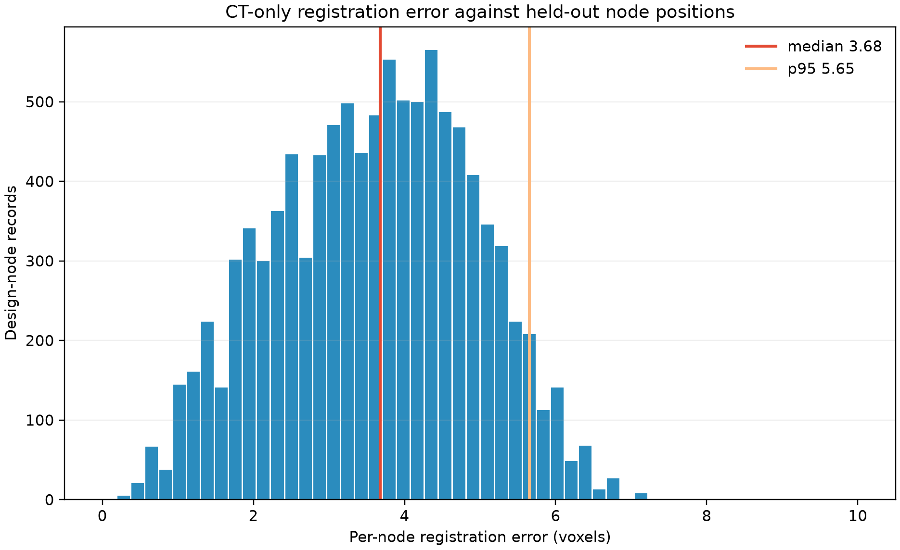

# Autonomous CT Registration

This proof of concept estimates a seven-degree-of-freedom similarity transform from the
ideal octet-lattice graph into CT voxel coordinates using only the CT intensities during
fitting. The supplied registered JSON is held out until the fitted transform and our own
registered JSON have already been written.

## Run

From the repository root:

```bash
python3.11 poc/ct_registration/register_ct.py
```

Requirements are NumPy, SciPy, tifffile, and Matplotlib. The TIFF is memory-mapped and the
EDT detection is performed on a factor-two sample, so the full 990 MiB volume is never cast
to a multi-gigabyte floating-point array.

## Method

1. Threshold the CT at the frozen value 40129 and verify the foreground count.
2. On the central CT depth range, compute a factor-two Euclidean distance transform. Label
   radius-thresholded components and retain lattice-scale components as candidate nodes.
   Thick scan end caps and tiny components are excluded.
3. Initialize scale and translation from the thresholded CT envelope; rotation starts at
   identity because the scan is nearly axis-aligned.
4. Fit the 3,430 unique physical design locations to the detected candidates using 70%-trimmed
   correspondence-free ICP and an Umeyama similarity update.
5. Refine predicted nodes against full-resolution local CT distance transforms, rejecting
   missing, outlying, and end-cap localizations.
6. Apply the frozen transform to all 10,206 design node records and write `our_registered.json`.
7. Only then read the held-out registered JSON and calculate validation metrics.

## Results

The CT-only fit detected 3,501 candidate peaks and converged to:

```text
scale       = 39.182525 voxels/design-unit
rotation    = 0.392466 degrees
translation = (60.907649, 55.671848, 29.628577) voxels
```

Held-out validation (performed only after the fit was frozen):

| Metric | Result | Gate |
|---|---:|---:|
| Median node error | 3.681 voxels | < 5 |
| Mean node error | 3.598 voxels | — |
| P95 node error | 5.655 voxels | — |
| Relative scale error | 0.776% | < 1% |
| Rotation-magnitude error | 0.057° | < 0.2° |
| Translation error norm | 4.966 voxels | < 6 |
| Mean 5×5×5 foreground fraction | 92.23% | ≥ 85% |

All validation gates pass. Machine-readable details are in `results/validation.json`, and
the registered design graph is `results/our_registered.json`.


